# L7-CNN

# Convolutional Neural Networks

## Components of a CNN

- Convolutional layers
- Pooling layers
- Normalization layers

## Convolutional Layers

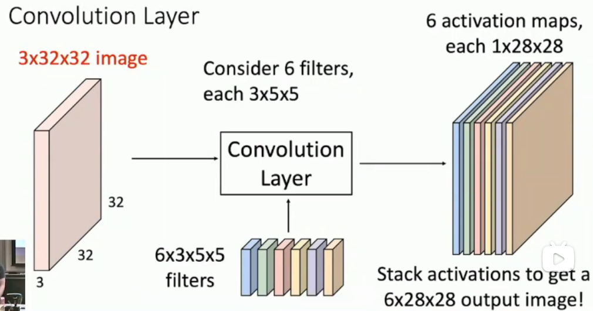

注意到一个通道的卷积核也是全通道数 **3** x5x5

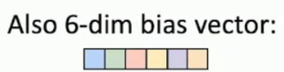

偏置是一个向量

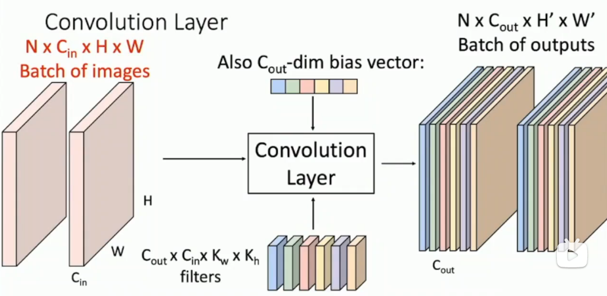

(b, c, h, w)表示batch size, channel, height, width!

注意四个维度的意义

卷积本质上也是一种linear layer，所以要relu等

高维全局，低维局部
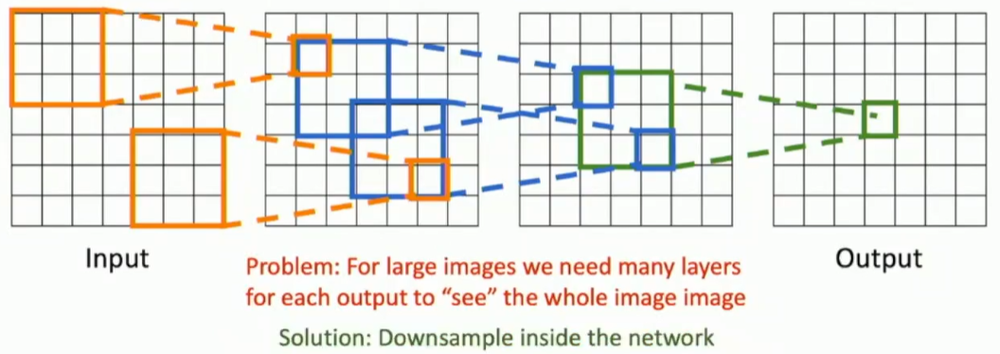
### 1x1 Convolutions
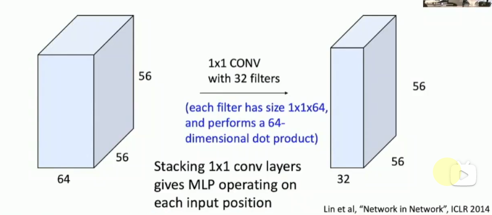
一种适配器，调整通道数

### other types of convolutions
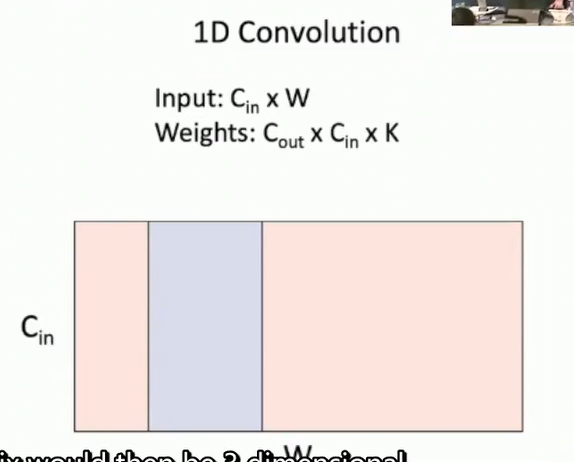
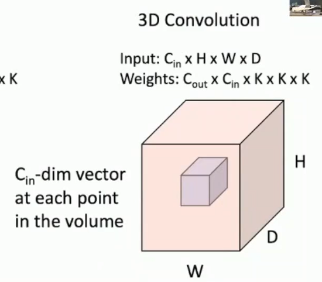
### PyTorch Implementation
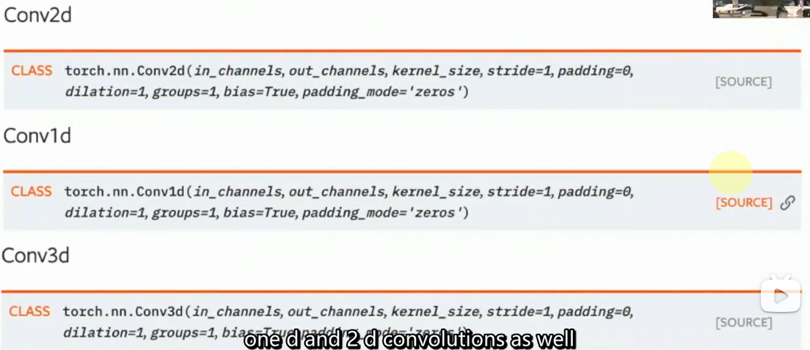


## Pooling Layers
another way to downsample data, no learnable parameters

局部最大值微小移动不变性

## Normalization Layers
主要讨论的是batch normalization

层与层之间数据分布更加稳定
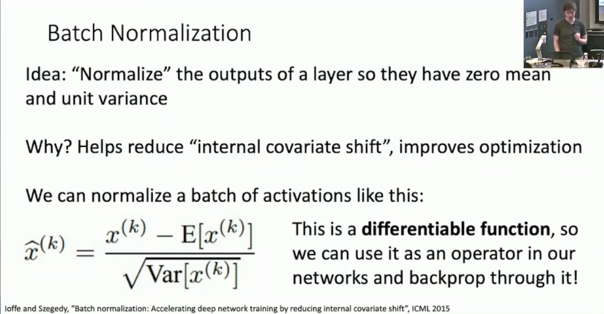
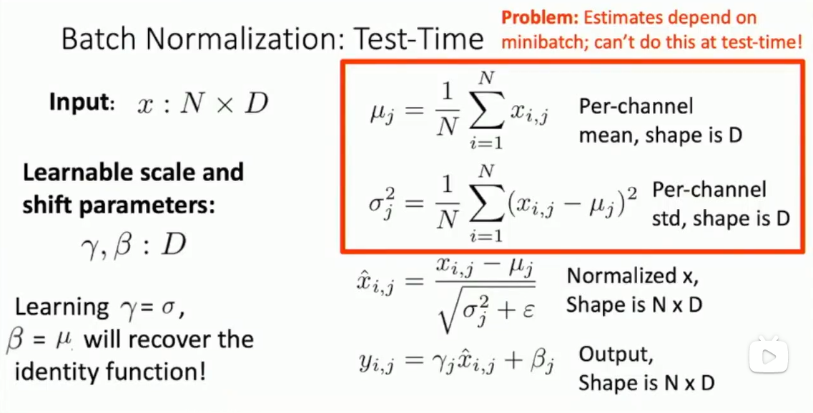
此时
```python
model.eval()
```
此时bn可以作为线形层被fuse进入fcnn or conv

layer norm也有，主要是rnn和transformer用到了
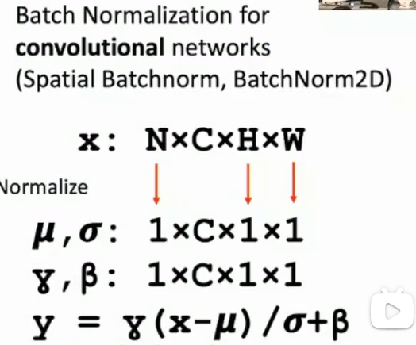

## Example: LeNet-5
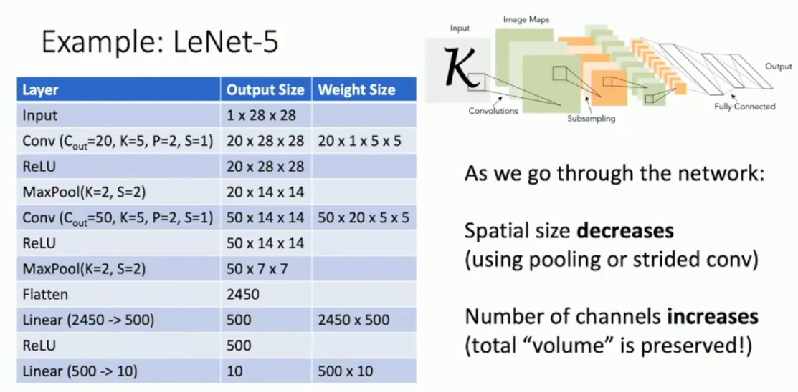


