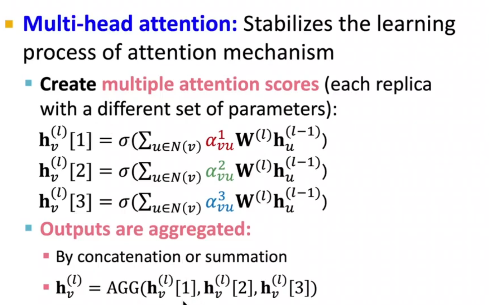

# L7-GNN t1

# L7-GNN theory 1

所有gnn的原型在这里

1. 一个layer

2. layers之间的交互

3. input graph -> computational graph的构建

GO!!!!
## a simple layer of GNN

1. msg computations
原神处理dddd

2. aggregation
核心：order invariance 焯这就是pointnet的核心之一啊！！！

issue： 容易忽略自己节点

### some examples of GNNs
#### GCN

#### GraphSAGE

这里的细节在于如何聚合邻居的信息

同时每层来个norm

#### GAT

首先解释一下什么是attention mechanism

单个attention的计算

多头attention的计算（更容易收敛）

### GNN layers in practice
glidar呼之欲出了 :scream:

有意思的东西:yum:

## stacking GNN layers

