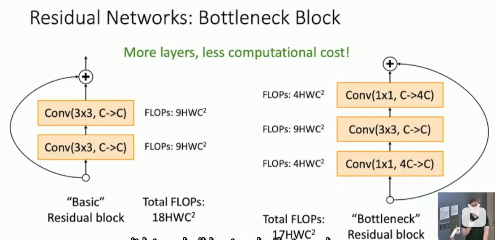

# L8-CNN Arch

# CNN Architectures

今日首绷


## 计算题

4 bytes per elem


右边三列体现了一个规律


2013的ImageNet winner仍然是AlexNet变体(ZFNet, ECCV)，只是trial and error的结果

2014的ImageNet winner是VGGNet ICLR，提出了规则化

- 3x3卷积核? 两个3x3卷积核 比 一个5x5卷积核 Params和FLOPs更少，但是感受野一样，并且可以插入更多的relu
- channel翻倍，每次卷积计算cost same amount of floating points computation

2014的ImageNet有GoogLeNet CVPR: 
- 初期快速下采样
- Inception模块: 
  - 1x1, 3x3, 5x5卷积核(使得kernel size不再是一个超参数)
  - 1x1适配器的引入
  - resnet雏形
- Global Average Pooling: 替换掉一层fcnn

- 其次还有auxiliary classifier取中间层输出，作为loss加入到loss function中

2015年首先是BN被发现了，auxiliary classifier被弃用
接着ResNet CVPR: 
- 引入残差结构，提升准确率
- 引入bottleneck结构，层数增加，但是flops减少

ECCV有一篇进一步讨论了残差块的结构


CVPR2017有一篇文章提出了ResNeXt

```python
torch.nn.Conv2d(groups=) # groups参数控制了分组卷积的数量
```
2017年的ImageNet结束

- DenseNet: fancier 趋势
- MobileNet: 轻量化趋势
- ICLR 2017自动化设计神经网络结构 Neural Architecture Search


