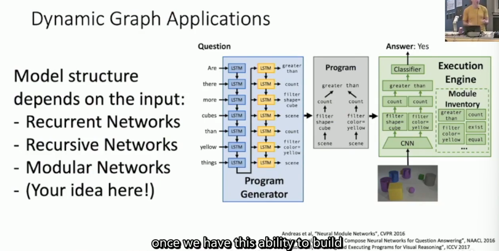

# L9-Hard and Software

# Hard and Soft ware
## Hardware
eecs 598.009 GPU programming!

其实我很想了解一下cuda编程

tensorflow支持TPU，pytorch呢？

计算图存储在GPU内存里面

## Software
the point of deep learning frameworks
- allow rapid prototyping
- automatically compute gradients
- run it all efficiently on GPUs or else

### PyTorch
sigmoid0减少计算图节点的设计，因为反向传播重写了
```python
class Sigmoid(torch.autograd.Function):
    @staticmethod
    def forward(ctx, input):
        y = 1 / (1 + torch.exp(-input))
        ctx.save_for_backward(input)
        return y

    @staticmethod
    def backward(ctx, grad_output):
        input, = ctx.saved_tensors
        grad_input = grad_output * (1 - y) * y
        return grad_input
def sigmoid(x):
    return Sigmoid.apply(x)
```

动态计算图 `loss.backward()` 之后计算图被丢弃？ 下一次计算的时候重新构建？


非动态计算图JIT，优化，序列化
```python
def model(x):
    return x * x

graph = torch.jit.script(model, torch.rand(1, 1))
```

### TensorFlow
1.0静态
2.0动态

TensorBroad


