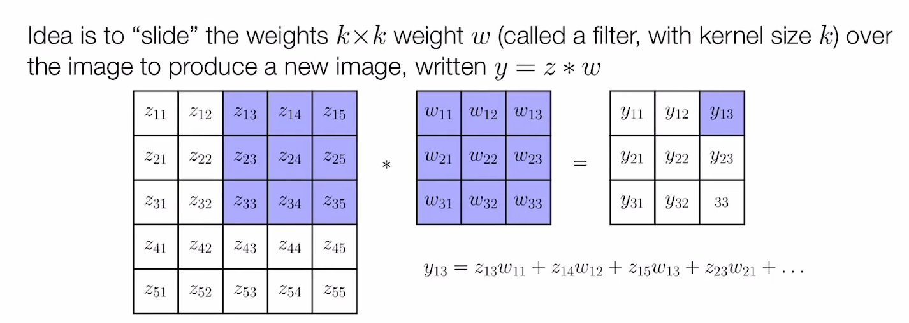
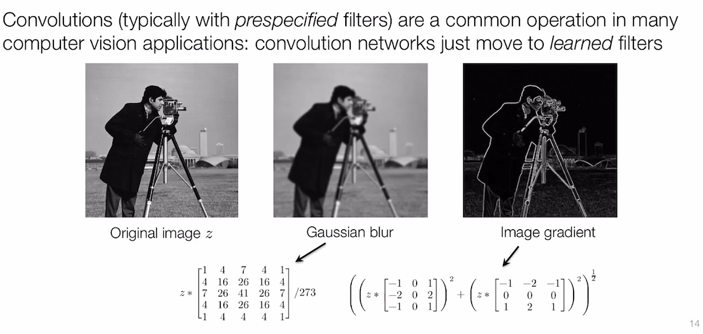
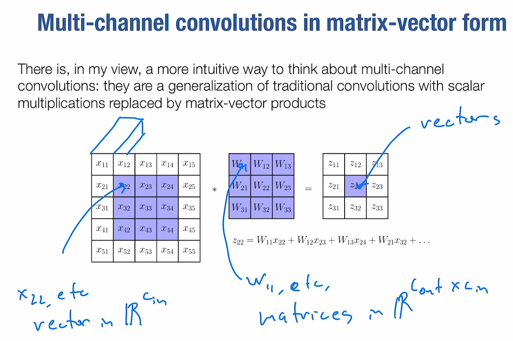
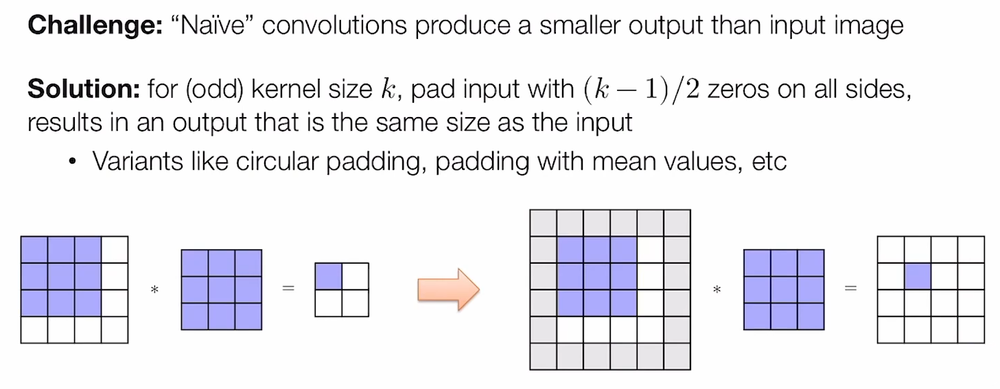
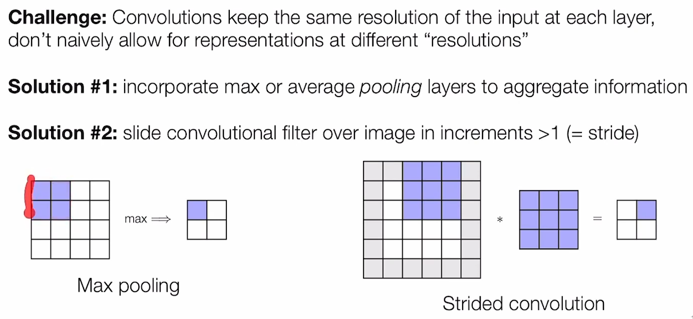
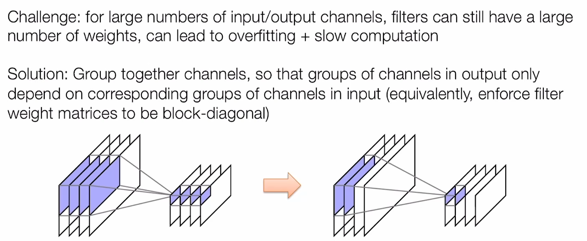
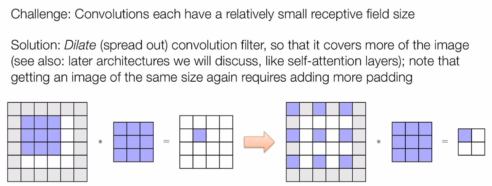
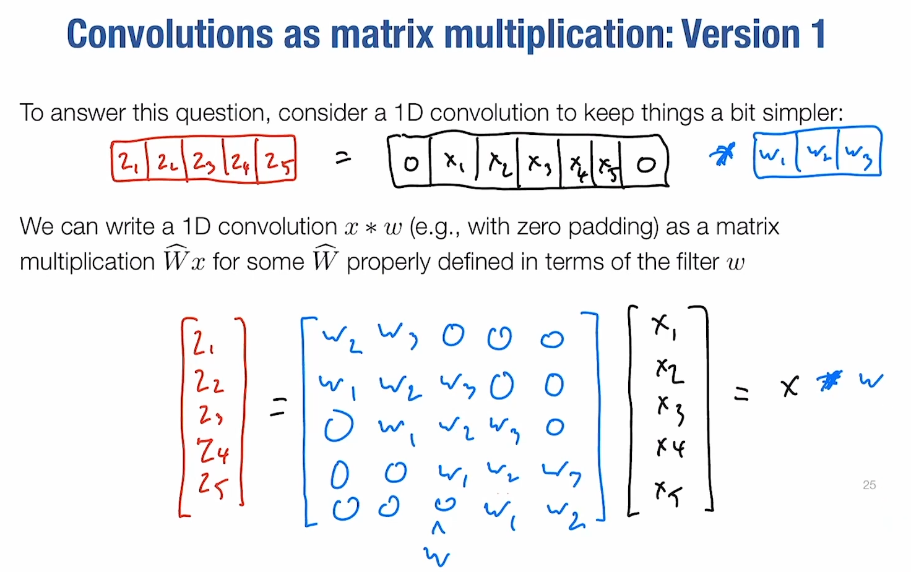
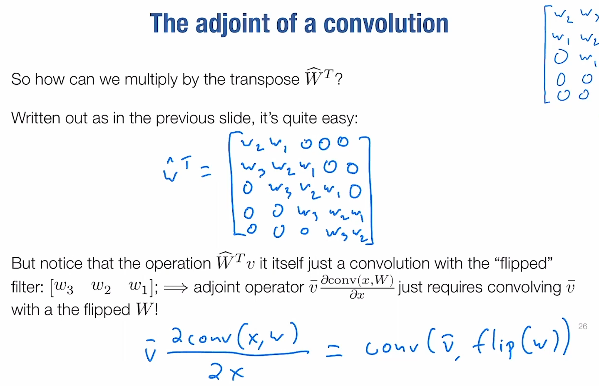
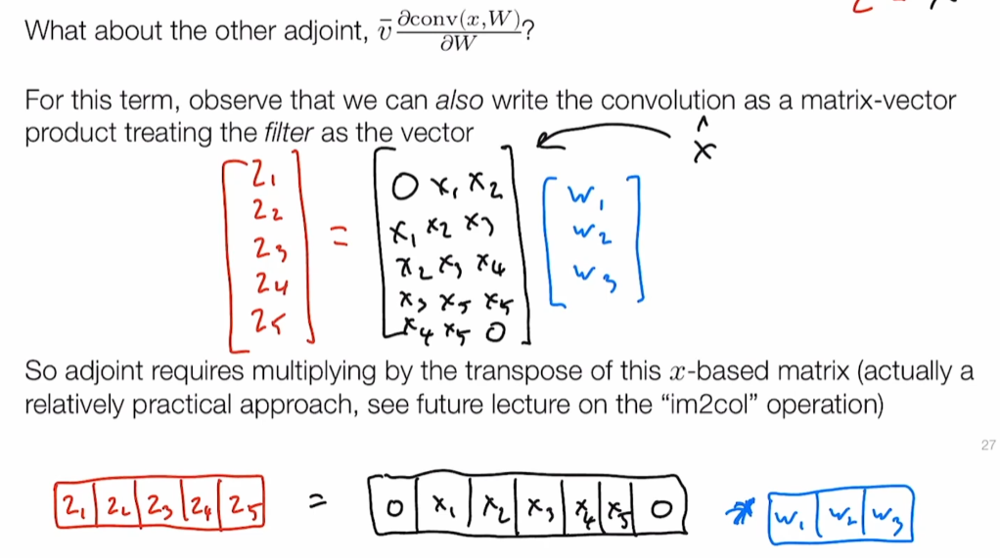

# Lec10-Convolutional Networks

# Convolutional Neural Networks
老朋友了 "capture the features"
## Convolutional Operator
事实上的计算，是信号处理里面的互相关运算

传统卷积处理

多通道卷积新视角:nerd_face:

## Elements of practical convolution

### Padding
为了维持尺寸不变

### Strides Convolution / Pooling
降低resolution，"downsampling" :nerd_face:

### Grouped Convolution!
分组卷积，可以提高计算效率

### Dilations Convolution
负责处理感受野的问题

## Differentiating Convolutional Layers!!
Naive way: just matrix and vector multiplication products :thinking:, but can lead to too much waste memory...

***Be an op in needle, not a module!***
### wrt. Input
首先有 $v^TW \iff W^Tv$ 自动微分链式法则的时候

事实上卷积可以有个等价的矩阵表示

然后写出来，发现等价于$conv(v, flip(W))$ :exploding_head:

### wrt. Weights

"im2col"操作十分有趣!在这里我们直接显式构造黑色的矩阵，一方面用来计算卷积，另一方面用来计算梯度:sunglasses:

