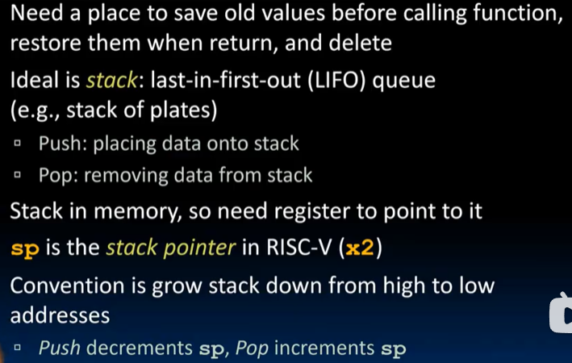
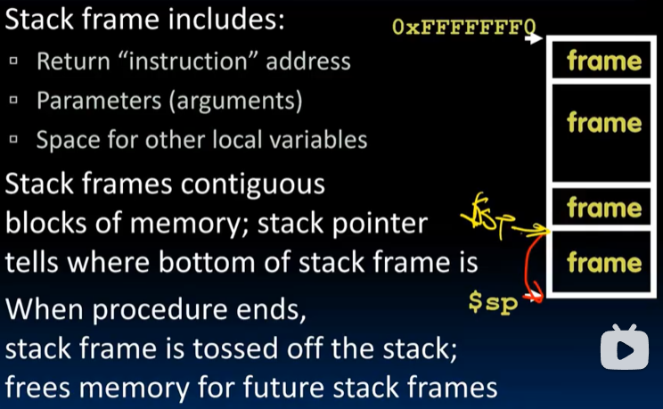
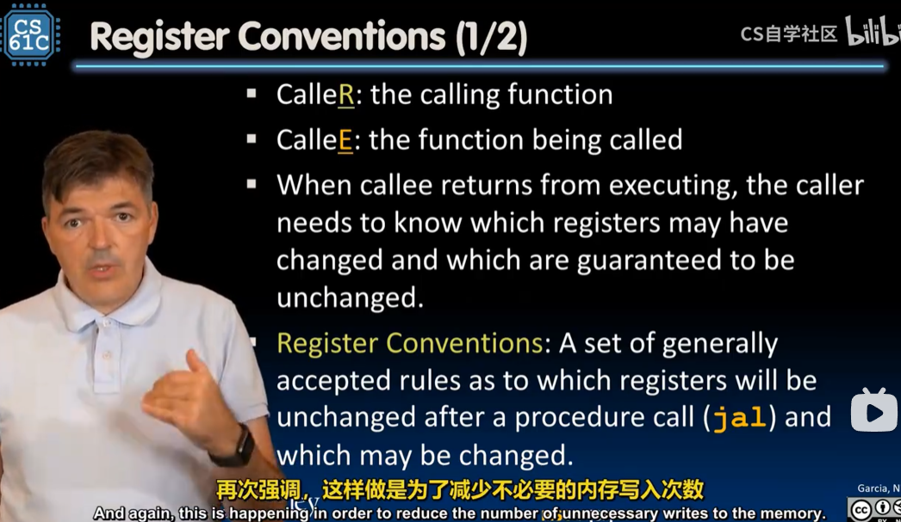
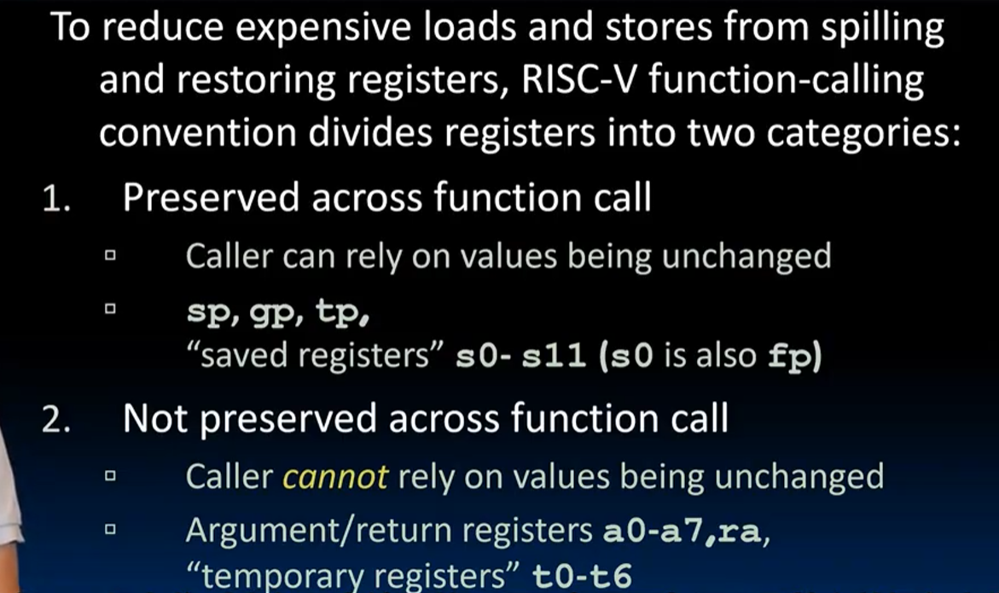
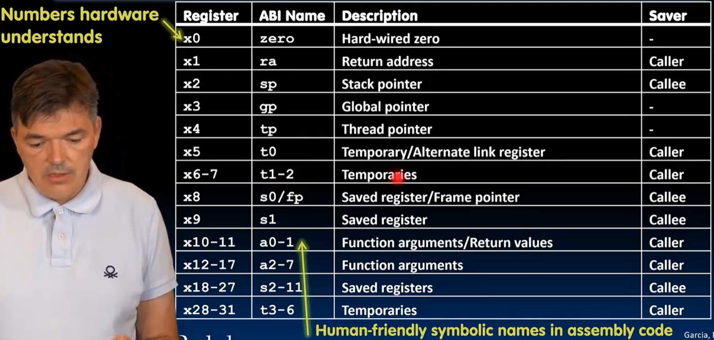
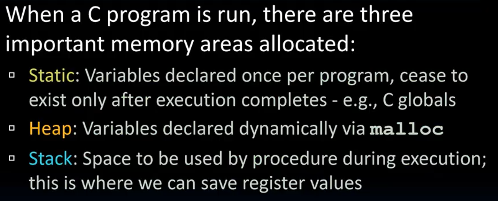
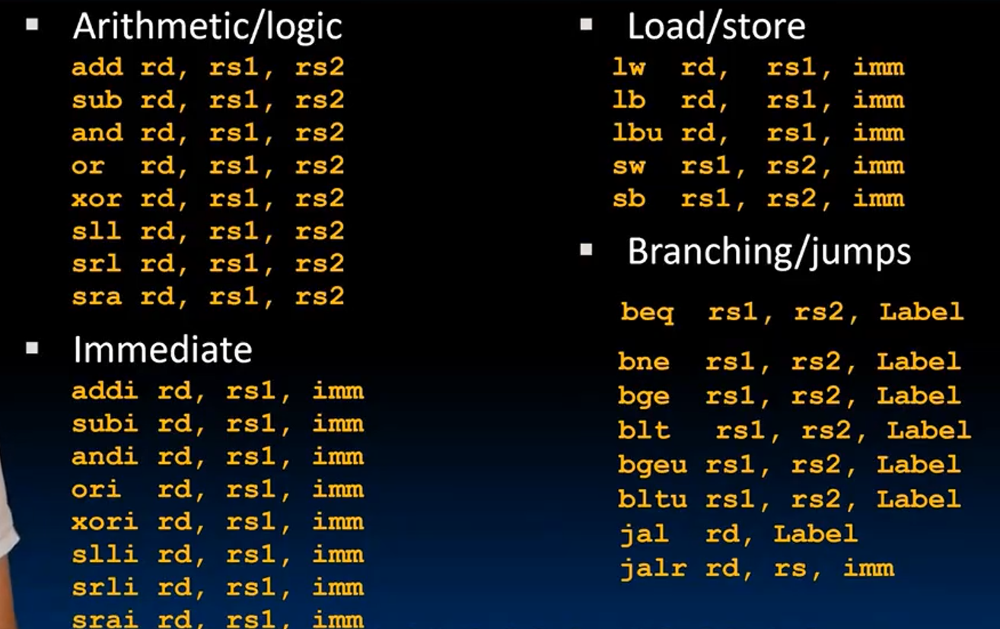

# Lec10-RISC-V Procedures

# RISC-V Procedures

调用函数的时候有一些无关的主进程变量的value需要存储，but where?

## 栈帧 / Stack Frame


存放了什么？

注意stack 从上往下增长，push sp--, pop sp++

### 序言prologue & 结尾epilogue
```c
int Leaf (int g, int h, int i, int j) {
    int f;
    f = (g + h) - (i + j);
    return f;
}
```

```assembly
Leaf:
    # 序言prologue
    addi sp, sp, -8  # 保存之前的栈指针
    sw s1, 4(sp)    # 保存参数
    sw s2, 0(sp)

    # 计算
    ...
    # 结尾epilogue
    lw s0, 0(sp)    # 恢复参数
    lw s1, 4(sp)    # 恢复之前的栈指针
    addi sp, sp, 8  # 释放栈空间
    ret # jr ra
```

## Nested Function Calls and Registers Conventions
此时ra显然不够用，怎么记录好返回的地址呢？
- 首先31个register要好好利用，怎么用,怎么存储需要的，放弃不需要的？
- 尽可能避免使用内存memory，尽量使用寄存器register






两种register，preserved and not-preserved(into **stack**)


0-31全家福 :yum:

注意如果callee想要使用caller-saved register，需要先保存caller的register，然后再恢复callee的register


## Memory Allocation
内存级别的划分（之前的讲座提到过）


具体地址划分如下，有几个特殊的寄存器管理


## Conclusion
so far instructions




