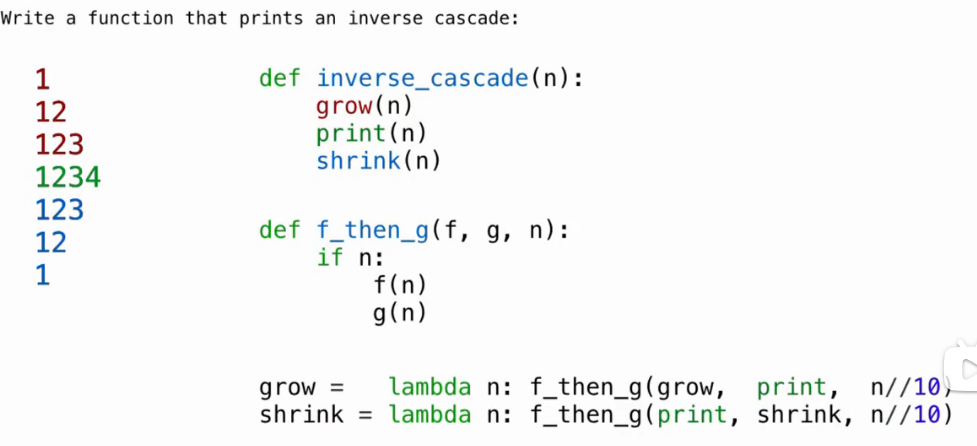
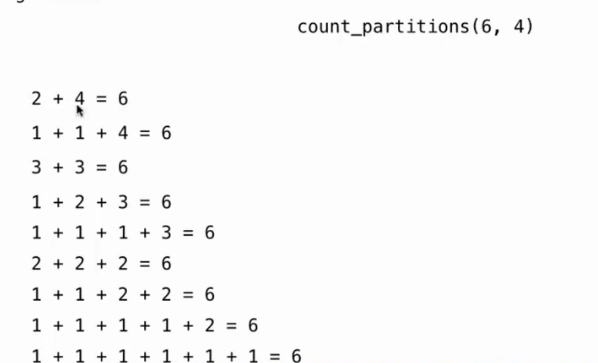

# Lec10-Tree Recursion

# Tree Recursion
## Inverse Cascade



## Tree Recursion

### 计算斐波那契数列
```python
def fib(n):
    if n == 0:
        return 0
    elif n == 1:
        return 1
    else:
        return fib(n-1) + fib(n-2)
```

并不是最好的实现 -> 在遍历的时候会重复计算相同的节点，得想办法存储中间结果 :thinking:

### Counting Partitions



```python
def count_partitions(n, m):
    """
    >>> count_partitions(6, 4)
    9
    """
    if n == 0:
        return 1
    elif n < 0 or m < 0:
        return 0
    elif m == 0:
        return 0
    else:
        with_m = count_partitions(n-m, m)
        without_m = count_partitions(n, m-1)
        return with_m + without_m
```


