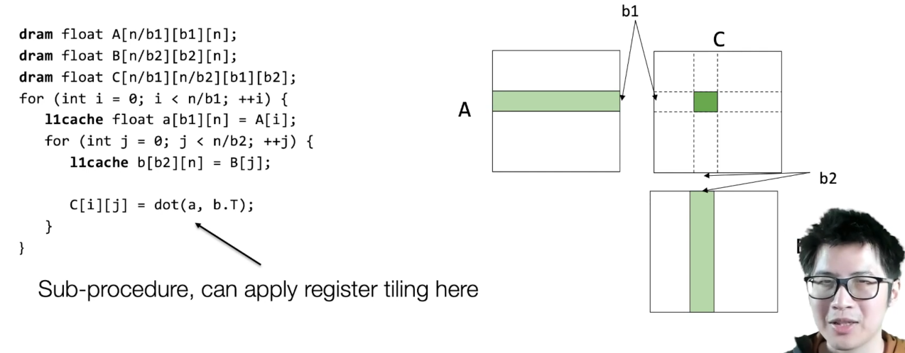
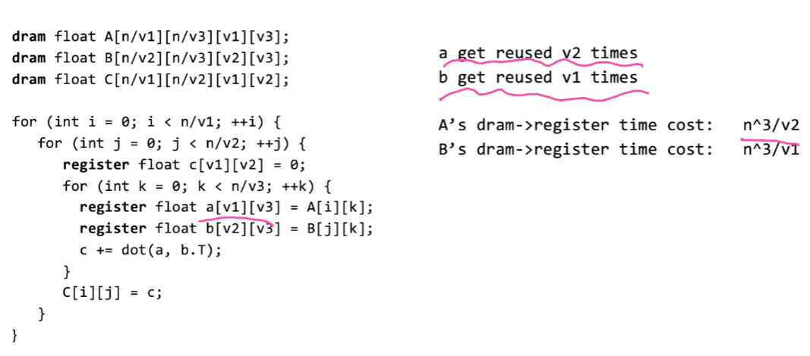

# Lec11-Hardware Acceleration for Linear Algebra

# Hardware Acceleration!!

## General acceleration techniques
### Vectorization

NumPy的向量化是通过底层的C语言以及编译过的函数实现的，其核心机制依赖于几个关键技术：


1. **内存连续存储**：NumPy数组在内存中是连续存储的，这意味着数据存储在连续的内存块中，这使得CPU缓存能更有效地工作。相比之下，Python列表中的元素可能在内存中是分散存储的。

2. **C语言实现**：NumPy的底层操作是用C语言编写的，这意味着NumPy的数组操作是在编译后的代码中执行的，而不是在Python解释器中。C语言的执行速度比Python快得多。

3. **统一函数接口**：NumPy定义了一种特殊的函数接口，称为ufunc（Universal Function），这种函数可以对数组的每个元素执行向量化操作。

4. **并行计算**：在某些情况下，NumPy还可以使用并行计算来进一步提高性能，如使用BLAS（Basic Linear Algebra Subprograms）库进行矩阵计算。

5. **数据类型一致性**：NumPy数组中的所有元素都是相同的数据类型，这使得可以对数组进行批量操作。

6. **减少函数调用开销**：在向量化操作中，函数调用是批量进行的，而不是在每个元素上单独调用，这减少了函数调用的开销。

7. **优化的数学运算**：NumPy中很多操作都经过了优化，比如使用SIMD（单指令多数据）指令集，这些指令可以在一个CPU周期内对多个数据执行相同的操作。

通过这些技术，NumPy实现了高效的向量化操作。当你使用向量化表达式时，NumPy会将这些操作转换为底层的C语言调用，从而实现快速的数组计算。

### Data layout and strides
- row major: default in C
- column major: Fortran...
- strides format: common in linalg libraries


strides format使得数组存储并不紧密，难以vectorize，所以在torch等库里面有一个函数叫`contiguous()`来将数组变成连续存储的，有利于计算


### Parallelization
- OpenMP: multi-threading, loops分配给不同的cpu来做

## case study: matrix multiplication
```c
// c = dot(a, b)
float A[N][N], B[N][N], C[N][N];
for (int i = 0; i < N; i++) {
    for (int j = 0; j < N; j++) {
        C[i][j] = 0;
        for (int k = 0; k < N; k++) {
            C[i][j] += A[i][k] * B[k][j];
        }
    }
}

```
时间复杂度：$O(N^3)$
### cpu architecture aware analysis
#### naive implementation
```c
// c = dot(a, b)
dram float A[N][N], B[N][N], C[N][N];
for (int i = 0; i < N; i++) {
    for (int j = 0; j < N; j++) {
        register float c = 0;
        for (int k = 0; k < N; k++) {
            register float a = A[i][k];
            register float b = B[k][j];
            c += a * b;
        }
        C[i][j] = c;
    }
}
```
naive分析


#### register tiled matrix multiplication

side note: 
$$
\frac{n}{v_1} \times \frac{n}{v_2} \times \frac{n}{v_3} \times v_1 \times v_3 = \frac{n^3}{v_2}
$$

let $v_3 = 1$

#### cache line aware tiling


在一级缓存中存数据，注意限制

#### all in one


l1speed: l1 -> register
dram speed: dram -> l1cache

***key insight: memory load reuse***



