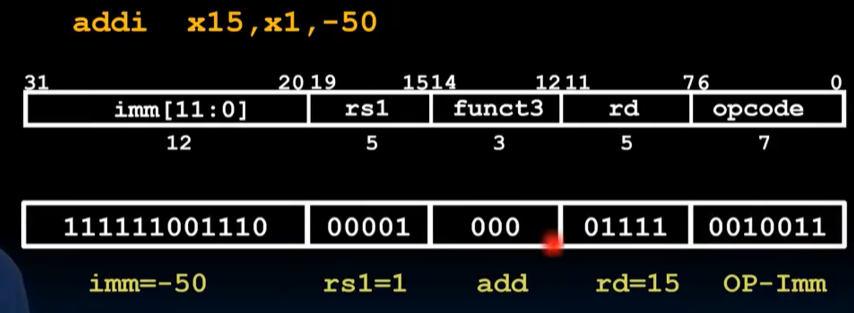
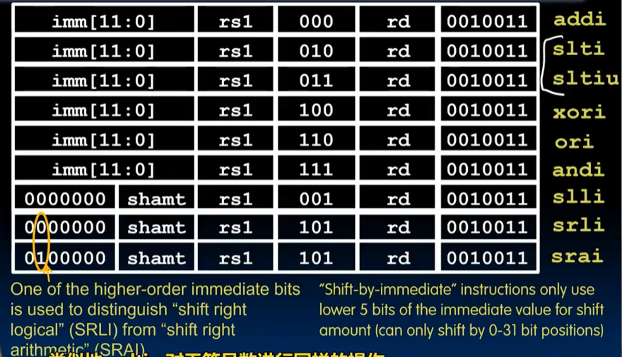

# Lec11-RISC-V Instruction Formats I

# RISC-V Instruction Formats I

事实上已经来到下一个层级(二进制)了，但是看标题似乎还是RISC-V :thinking:
## Background and Consequences
### 1. addressing modes
- everything has a memory address, so *branches* and *jumps* can use them
- PC (program counter, again :smile:) is a register that holds the address of the next instruction to be executed

### 2. 二进制兼容否？如何表示指令？

一个指令用1个word(32bits)来装绰绰有余

divide instruction into "fields" :yum:

## R-Format Layout
算数逻辑指令

- funct3: 功能码，决定指令的操作类型
- funct7: 扩展功能码，用于一些复杂的指令
- opcode: 操作码，决定指令的类别

具体查表

- new one: `slt` and `sltu` -- *set less than*, when rs1 < rs2, then set the destination register to 1, otherwise 0. `sltu` is similar but for unsigned numbers.

- `sub` & `sra` 0 ***1*** 00000 指示符号拓展

## I-Format Layout

- funct3: 功能码，决定指令的操作类型，***在这里只能指示8个***，然而有9条指令

具体查表

- new one: `slti` & `sltiu` -- *set less than immediate*, when rs1 < imm, then set the destination register to 1, otherwise 0. `sltiu` is similar but for unsigned numbers.

- **shamt** ? -- *shift amount* , 5 bits, 过多溢出全为0

### RV Loads
本质上是I-Format

具体查表

- place in the lower part, and 符号拓展

## S-Format Layout
十分丑陋划分32位

具体查表

