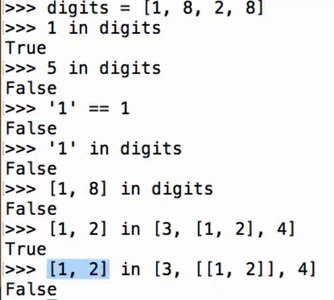
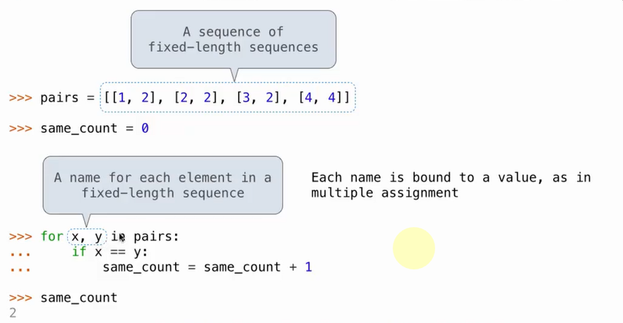
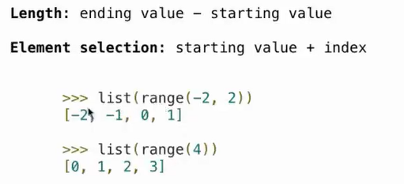
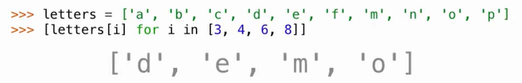

# Lec11-Sequences

# Sequences
## List

```python
my_list = [1, 2, 3, 4, 5]
getitem(my_list, 2)  # Output: 3

```
加法乘法是 **拼接**


## Container

### in
```python
my_list = [1, 2, 3, 4, 5]
5 in my_list  # Output: True
```



```python
for i in my_list:
    print(i)
```

### unpacking


### range
```python
range(5)  # Output: range(0, 5)
range(1, 5)  # Output: range(1, 5)
range(1, 10, 2)  # Output: range(1, 10, 2)
```

左闭右开



### 下划线变量命名
```python
_ = 1  # 单个下划线
__ = 2  # 双下划线
__my_var = 3  # 双下划线开头的变量名
```

### List comprehension




```python
[x for x in range(5) if x % 2 == 0]
```


