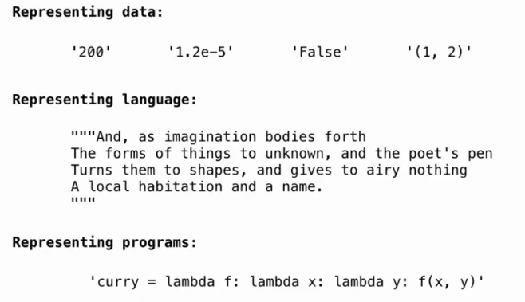
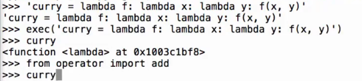
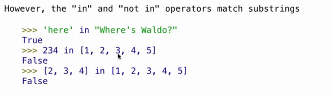
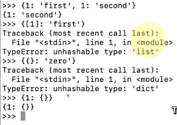
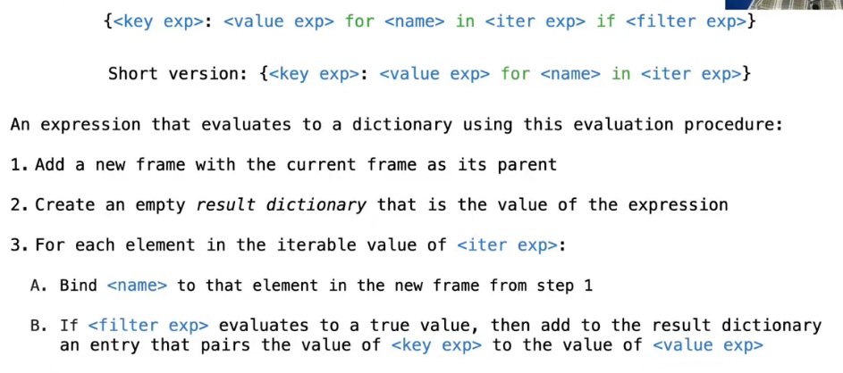

# Lec12-Container

# Container

## box and pointers
见61B :yum:


## slice
传统python中，slice操作符的语法为`[start:stop:step]`，其中`start`和`stop`是切片的起止位置，`step`是切片的步长（左闭右开）

切片生成新的序列，对原序列的修改不会影响切片（物化view的感觉）

## Process value in container

### aggregate functions
- `sum(container)`：返回容器中所有元素的和
```python
sum([1, 2, 3, 4, 5])  # 15
sum([1, 2], 9) # 12
sum([[2, 3], [4]], []) # [2, 3, 4]
```

- `max(container)`：返回容器中最大的元素

```python
max(range(10), key=lambda x: 7-(x-4)*(x-2)) # 3
```

- `all(container)`：如果容器中所有元素都为真，则返回True，否则返回False
```python
all([True, True, True]) # True
all([True, False, True]) # False
all([x < 5 for x in range(5)])
```


## Strings

注意事实上程序只是字符串 :yum: 和61B的text写java一个道理



```python
exec('some_code')
```



## Dict
:anger: 我一直觉得这个和 `Map<K, V>` 以及json的关系不清不楚

```python
num = {'I': 1, 'V': 5, 'X': 10}
list(num) # ['I', 'V', 'X']
num.values() # dict_values([1, 5, 10])
empty = {}
```



### dict comprehension


```python
{x: x**2 for x in range(5)} # {0: 0, 1: 1, 2: 4, 3: 9, 4: 16}
```




