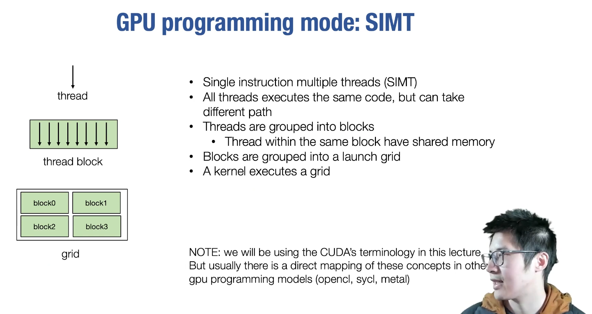
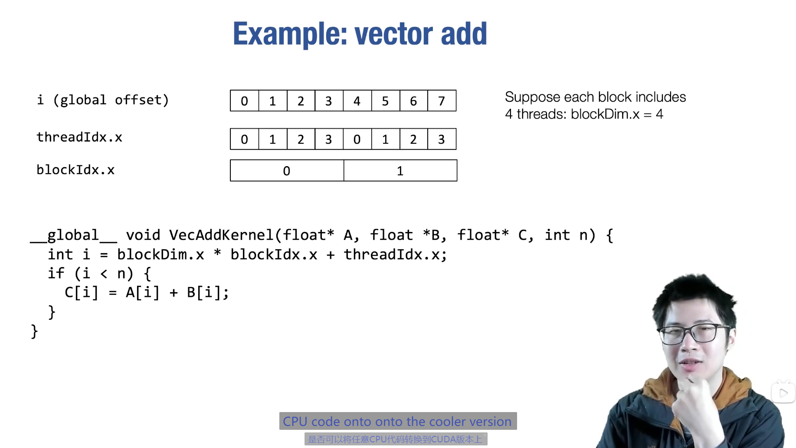
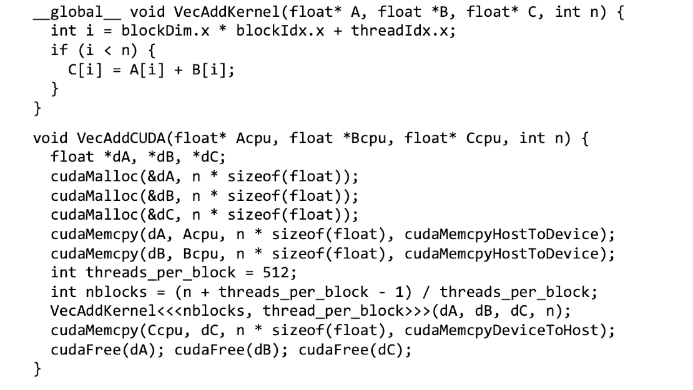
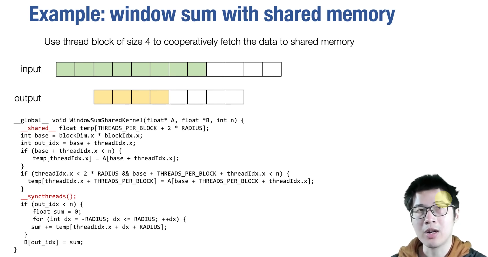
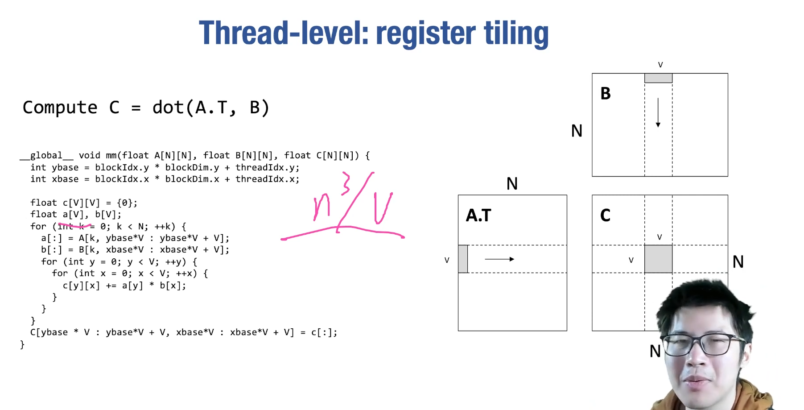
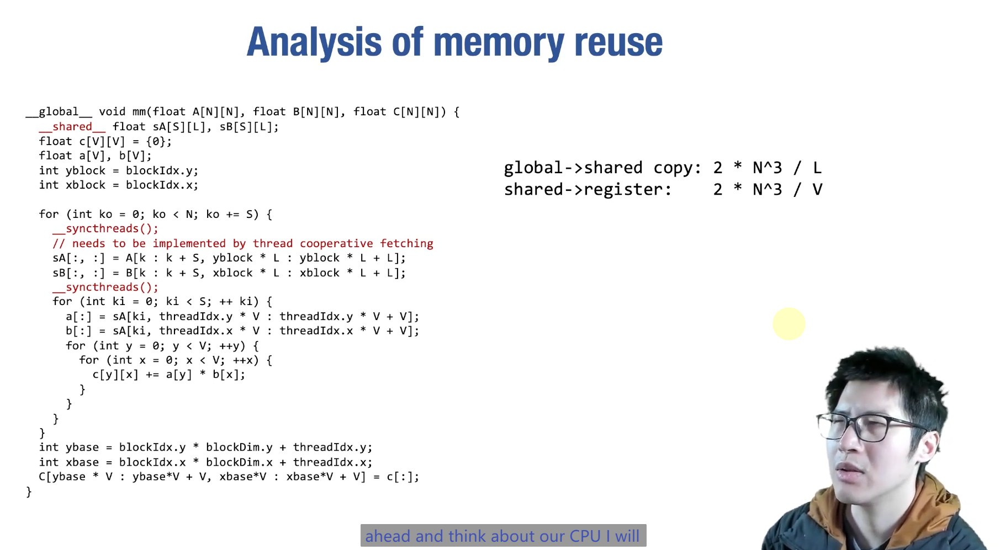
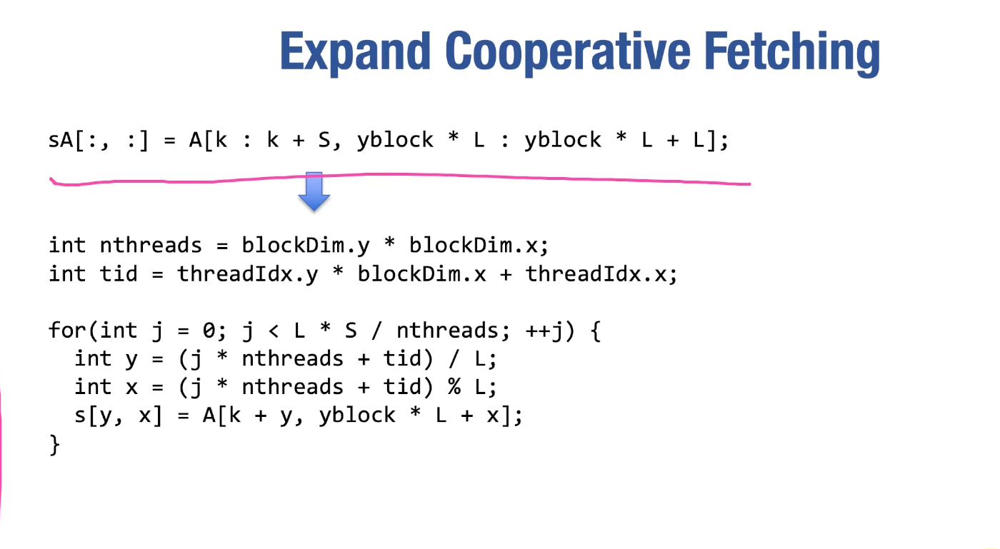
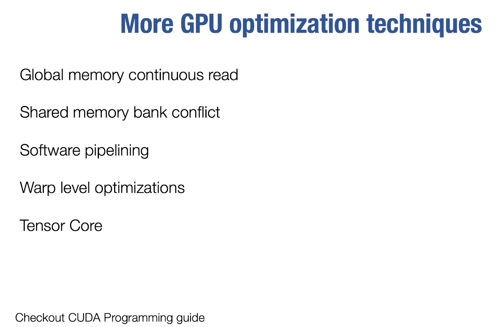

# Lec12-Hardware Acceleration + GPUs

# GPU Acceleration
## GPU Programming 
gpu 具有良好的并行性

### a single CUDA example

注意到计算所需变量互不相关，所以可以并行计算

数据IO操作是瓶颈

keep data in GPU memory as long as possible --> call `.numpy()` less frequently

### GPU memory hierarchy
利用shared memory

- launch thread grid and blocks
- cooperative fetch common to shared memory to increase reuse


## case study: matrix multiplication on GPU
```shell
Compute C = dot(A.T, B)
```
### thread level

```c++
__global__ void mm(float A[N][N], float B[N][N], float C[N][N]) {
    int ybase = blockIdx.y * blockDim.y + threadIdx.y;
    int xbase = blockIdx.x * blockDim.x + threadIdx.x;
    float c[V][V] = {0};
    float a[V], b[V];
    for (int k = 0; k < N; k++) {
        a[:] = A[k, ybase*V : ybase*V+V];
        b[:] = B[k, xbase*V : xbase*V+V];
        for (int y = 0; y < V; y++) {
            for (int x = 0; x < V; x++) {
                c[y][x] += a[y] * b[x];
            }
        }
    }
    C[ybase*V : ybase*V+V, xbase*V : xbase*V+V] = c[:];
}
```

### block level: shared memory tiling

:exploding_head: 吃了没有完全学习好架构体系的亏!


多线程使得计算和加载数据同时进行


合作fetching也有意思捏

### More...



