# Lec12-RISC-V Instruction Formats II

# RISC-V Instruction Formats II

## B-Format Layout
branch/分支 ==> if-else, while, for

encode Label: 

PC寻址, 用imm field来表示偏移量  

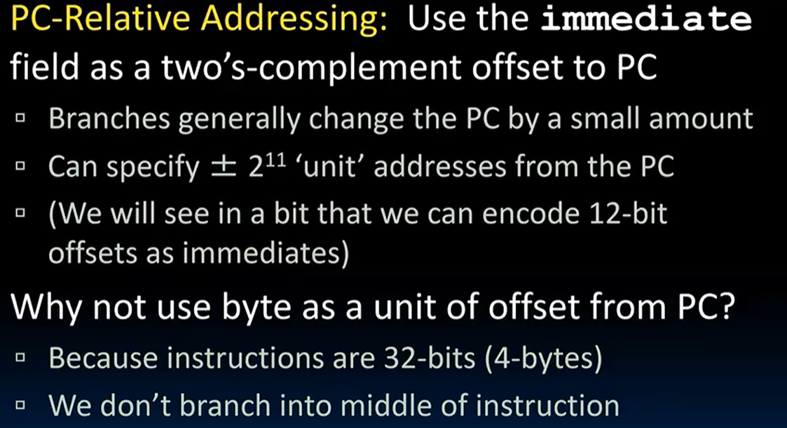

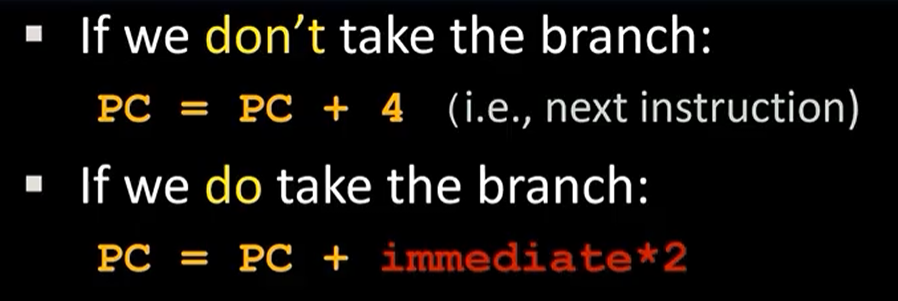

实际上 RV compressed instruction format! 16bit 压缩指令格式，偏移量不再是4的倍数，而是2的倍数（所以imm 二进制结尾一定是0）

理论layout
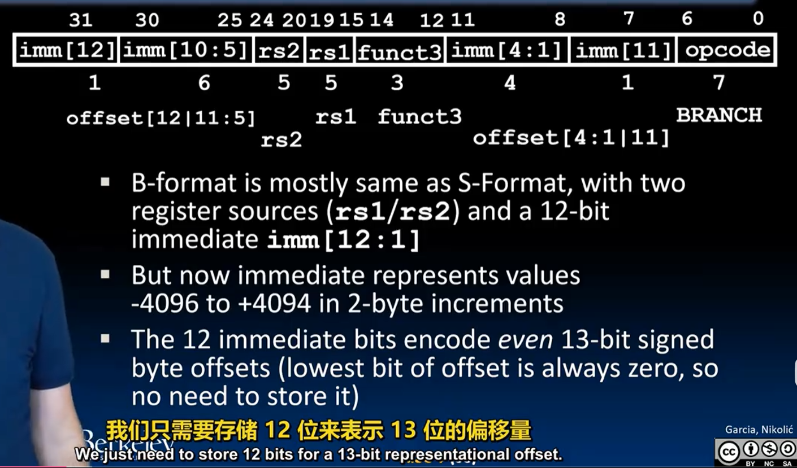

解释一下如何从指令解析出立即数的数值

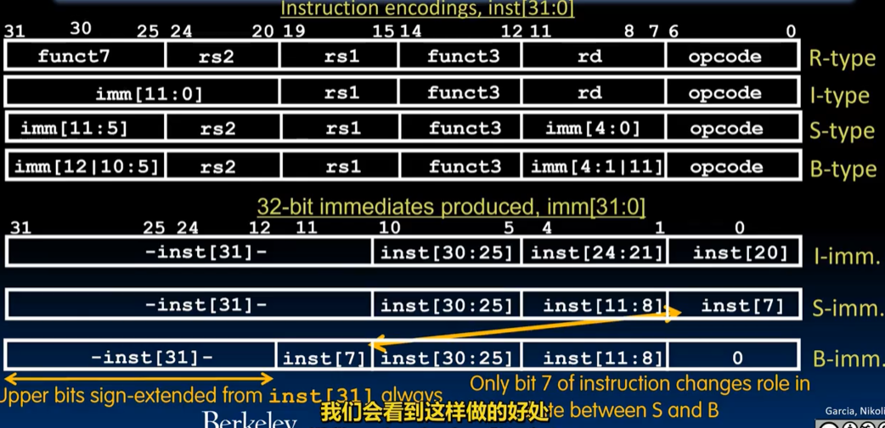

B-type "|" 意思是专门分出一块区域来存一位数字

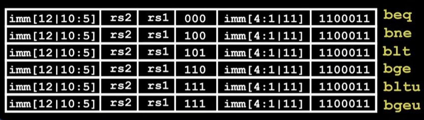

## Long Immediate， U-Format Layout

I, B, S imm的12位扩展到long，找个地方放下剩下的20位

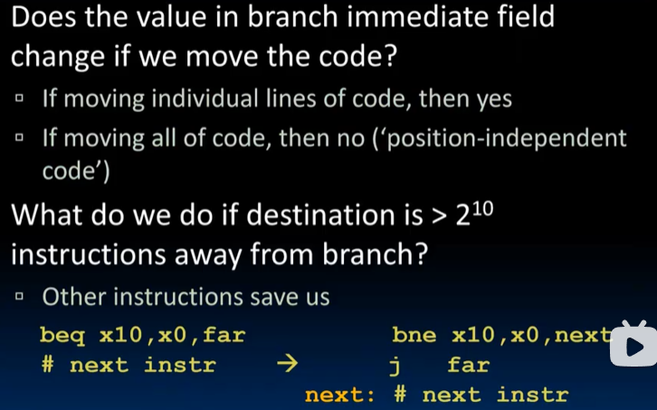

注意这里不直接使用branch指令跳转，而是采用jump直接来做

地方来了：同时来了两个新的指令`lui` & `auipc`
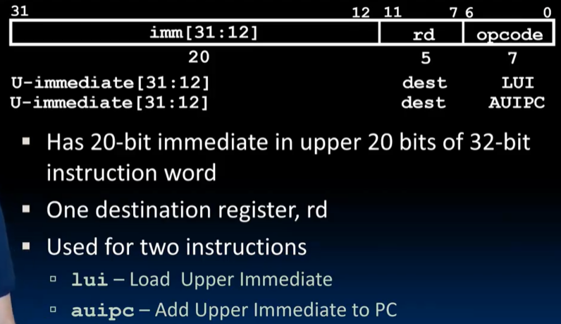

### Corner case
有符号扩展带过来的，1开头的符号扩展

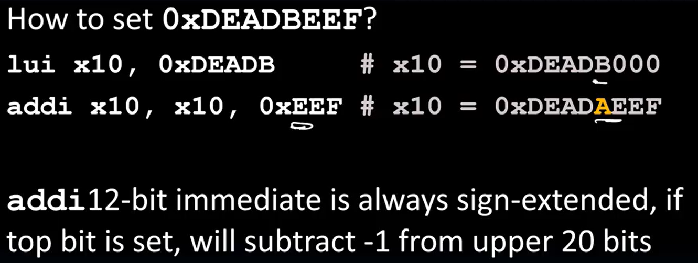

用+1来避免这个问题

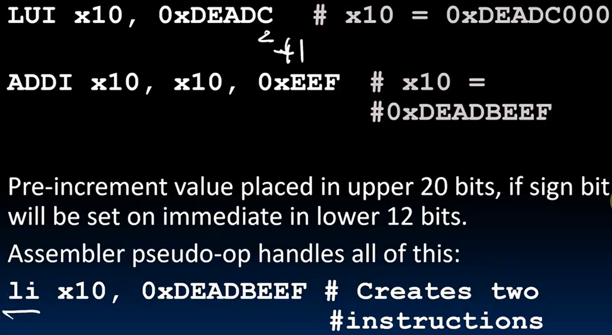

补充 `auipc` 指令
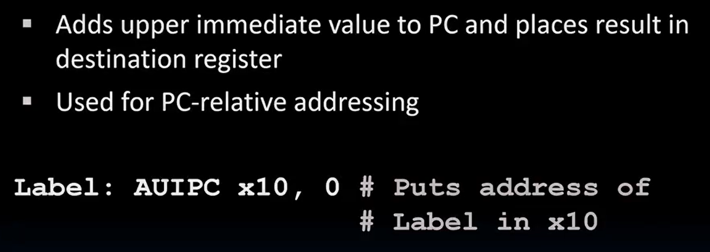

## J-Format Layout

只有jal，因为jalr是I-type的

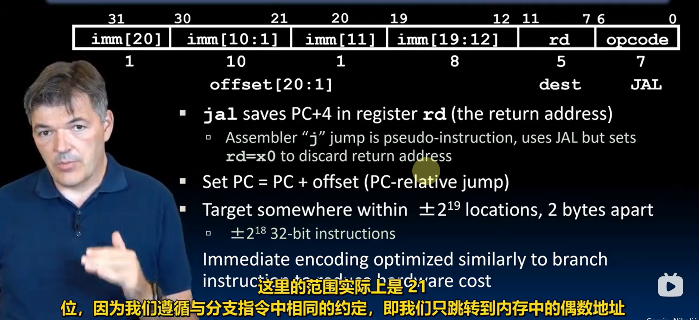

使用示例

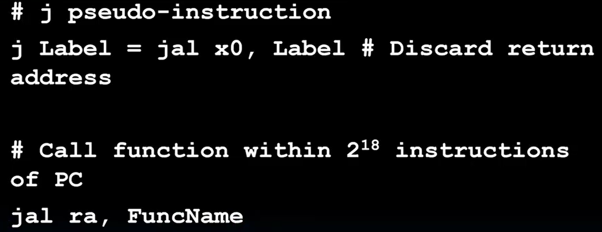

jalr
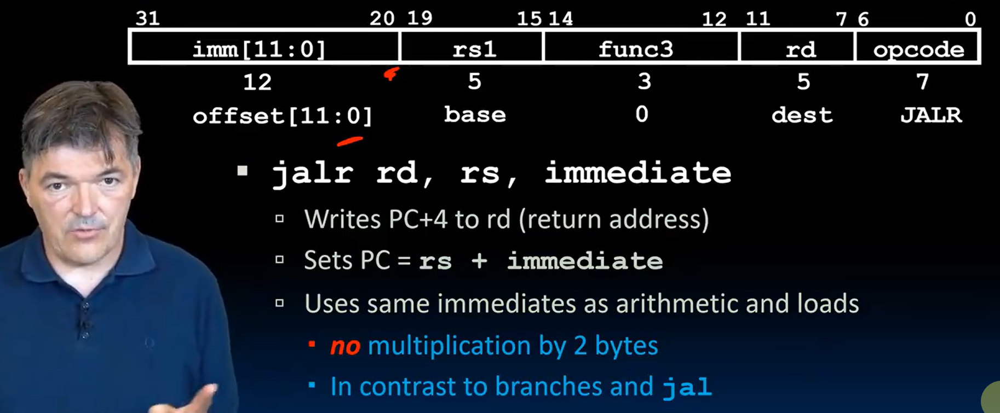

使用示例

留一个[reference](https://www.cse.cuhk.edu.hk/~byu/CENG3420/2023Spring/doc/RV32-reference-1.pdf)

