# Lec13-Compiling, Assembling, Linking and Loading

# Compiling, Assembling, Linking and Loading

CALL

## Interpretation and Translation
### Interpretation
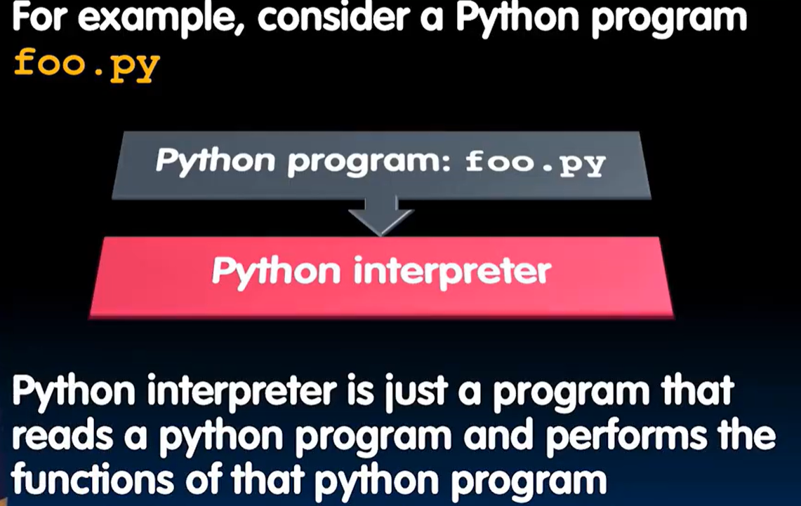

有一个解释器（是一个程序）

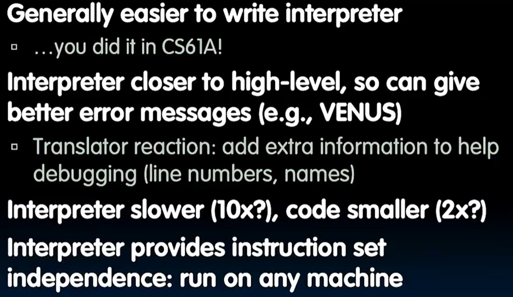
### Translation
翻译为低级的语言针对hardware更快操作


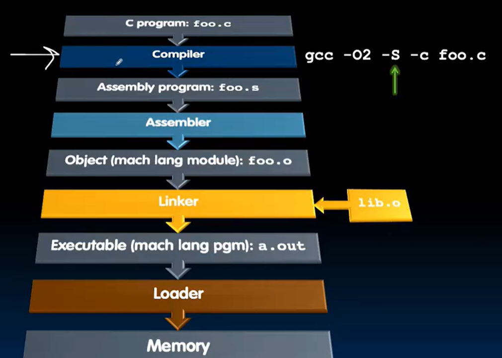
## Compiler
CS164 :thinking:

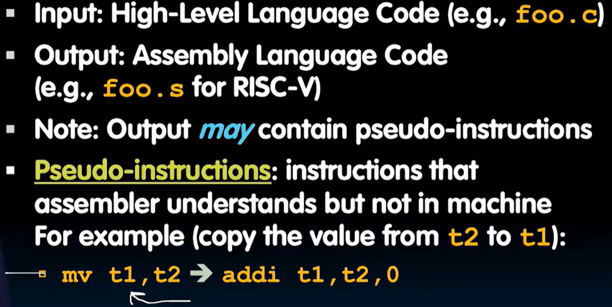

这么看来pseudo code确实存在？

## Assembler
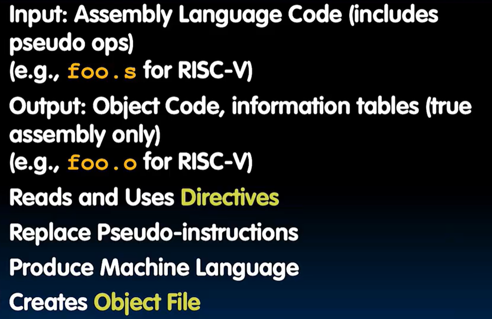

### Directives
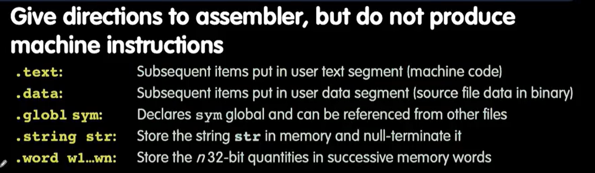


### Replacements
把pseudo code翻译成真实的RISC-V指令

### Producing real machine code
让.o文件确定终值 ==> object file

- 简单case：直接用.o文件
- Forward reference problem：确定标签位置，然后再用.o文件
- PC 相对寻址


### Symbol Table and Relocation Table
- symbol Table
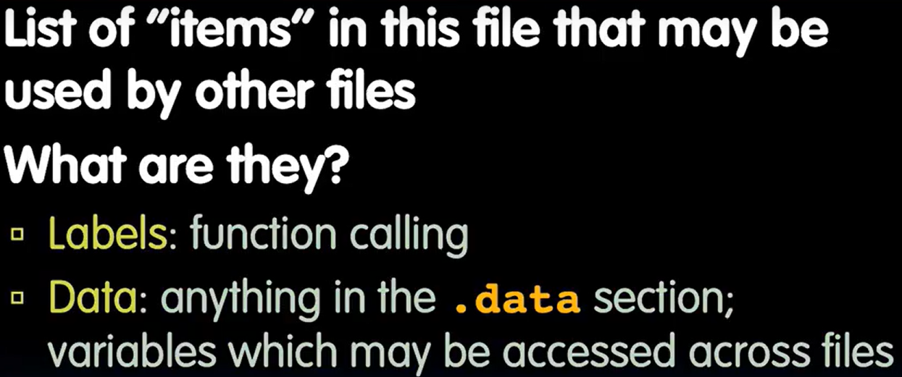

- label Table
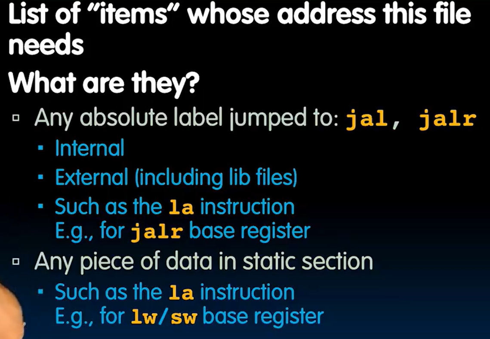

汇编器层面不知道static 之类的东西，所以需要暂时做个记号等待link处理

### Object File Format
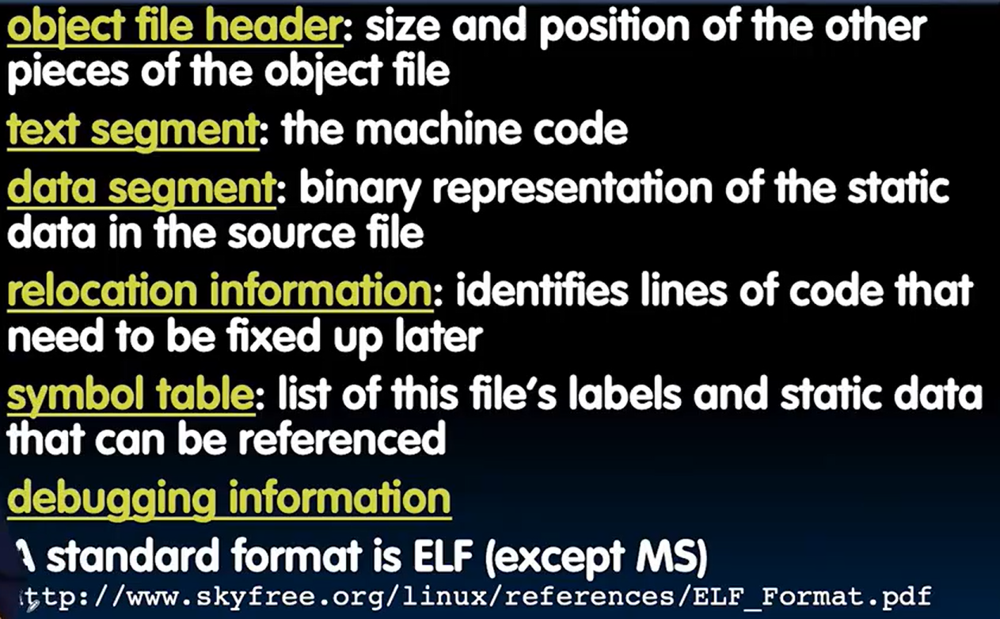


## Linker
what happen?


4 types of addressing

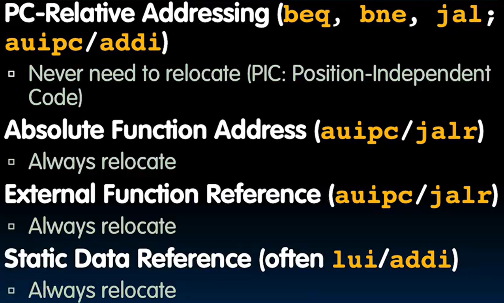

which instructions must be linked?
- J-format: j / jal
- L-, S-format: there is a `gp` !

### Resolving reference


然后在"user" symbol table中找到对应的地址，然后替换掉原来的符号

接着在library files同样操作

最后输出：*executable file*，containing text and data (plus header)==> 存储在 **磁盘** 上面

### static and dynamic linking

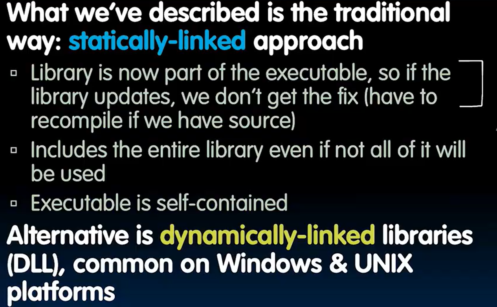

现在我知道`.dll` 文件是什么了:yum:

动态link通常在机器码级别进行，而不是汇编器级别

## Loader

什么是loader？ -- CS162 OS先导课程 :triumph:


Loader的作用：

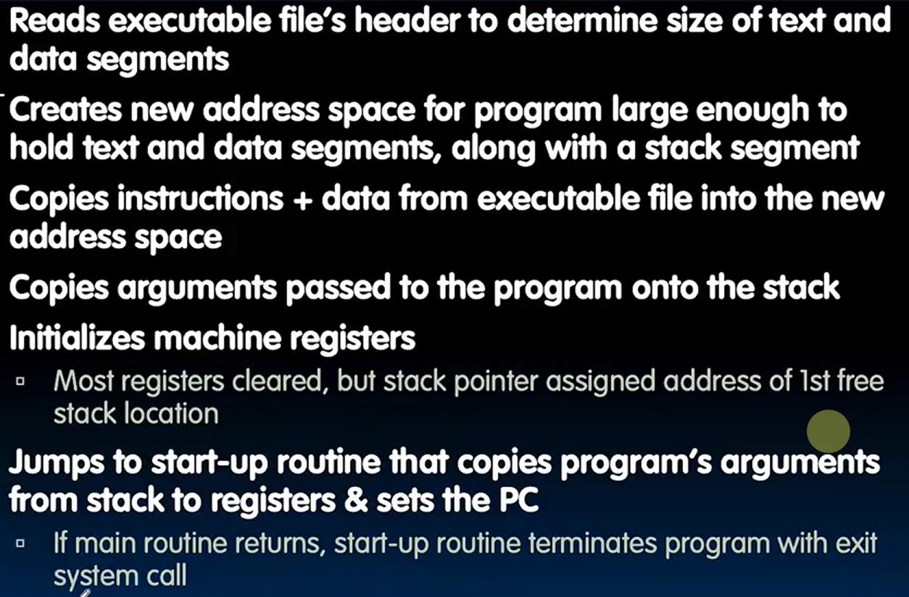

注意最后一行start-up routine的program's arguments 正是和 `argc` & `argv` 相关的 :open_mouth:

## EXAMPLE hello world !
```c
#include <stdio.h>

int main() {
    printf("Hello, %s\n", "world");
    return 0;
}
```

`.s` file:

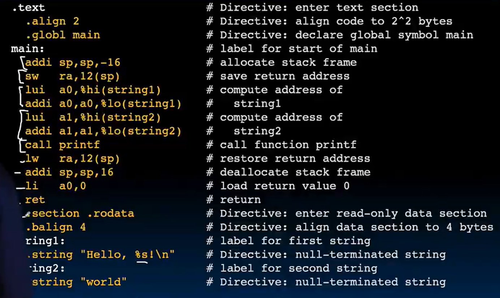

`.o` file:

只有字符存储在`.o`文件中！

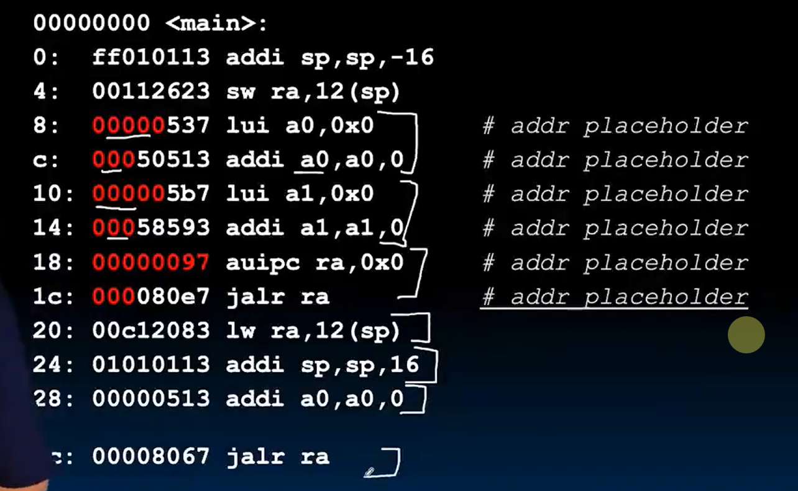

`.out` file:

红色的字符被补充了

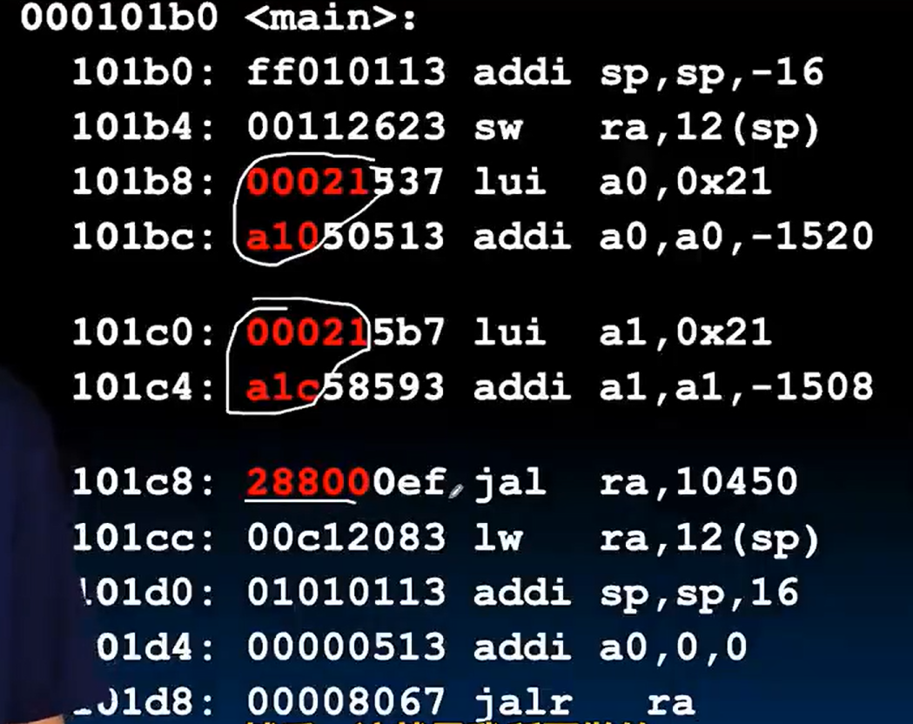


