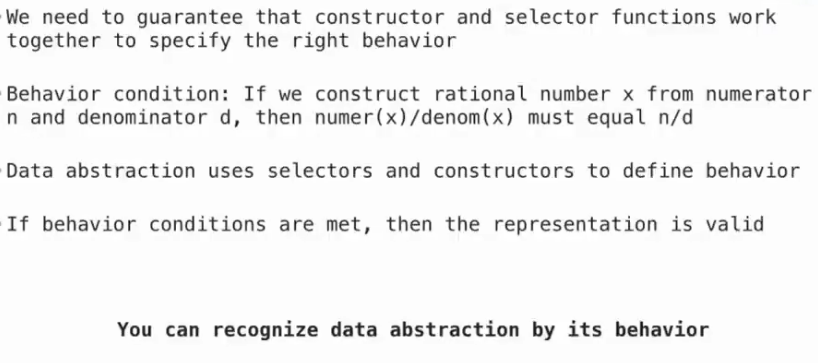
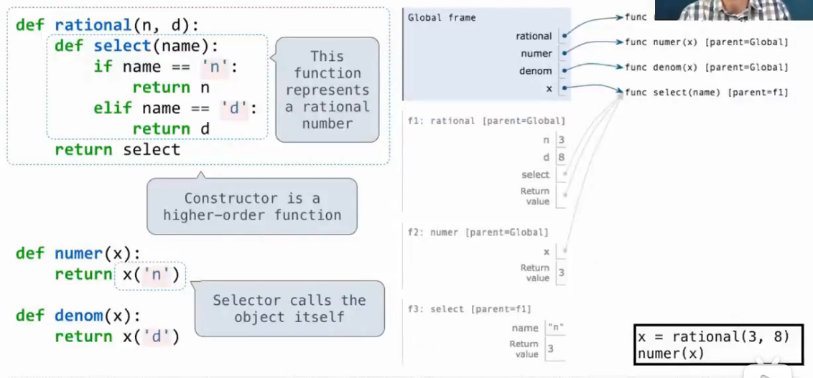
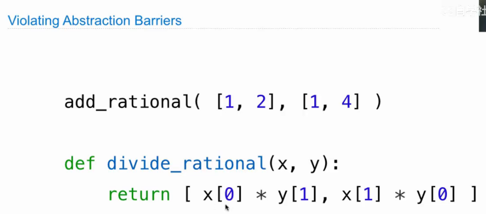

# Lec13-Data Representation

# Data Representation

what is data???



从对象的行为（函数与方法）来定义

## Example: Rational Numbers

纯粹使用函数来做接口而不是内在设置列表存储 :thinking:




## data representation -- a methodology
`constructor` & `selector` thoughts

感觉这里更像是api设计的思路，哲学思想



仔细思考用好 `constructor` 和 `selector` 的作用 ！

有没有一种可能，java没这么多事
## Pairs
和 `__getitem__` ?


```python
from operator import getitem
getitem(pair, 0) # first element
getitem(pair, 1) # second element
```

```python
from fractions import gcd
### gcd is used to find the greatest common divisor of two numbers
gcd(pair[0], pair[1]) # greatest common divisor
```

