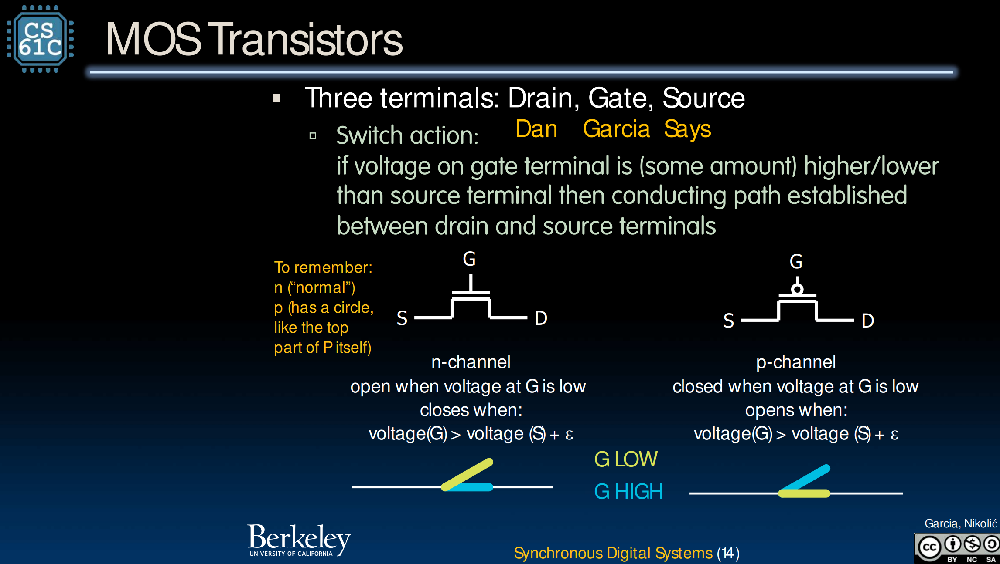
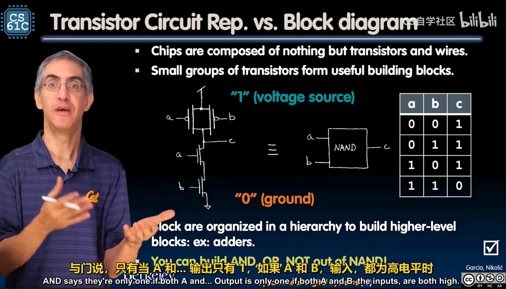
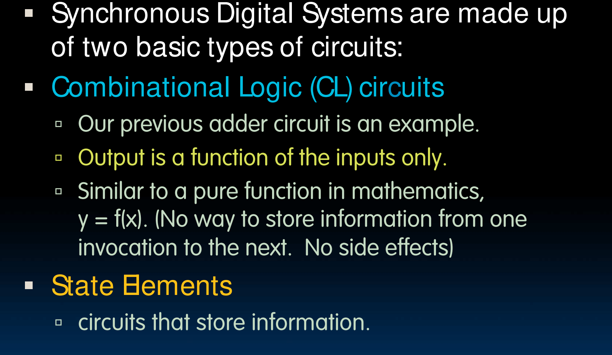

# Lec14-Intro to Synchronous Digital Systems

# Lecture 14: Intro to Synchronous Digital Systems

## MOS Transistors

- normal n-channel gate G is low, open.

## NAND Gates
与非门

## 电路存储与构成

- 组合逻辑电路
- 有状态元件 like 寄存器

