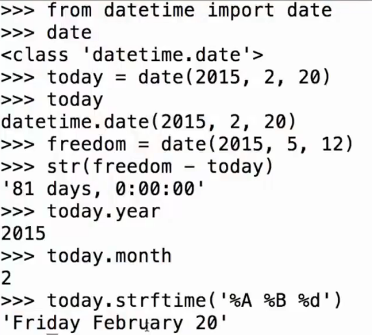
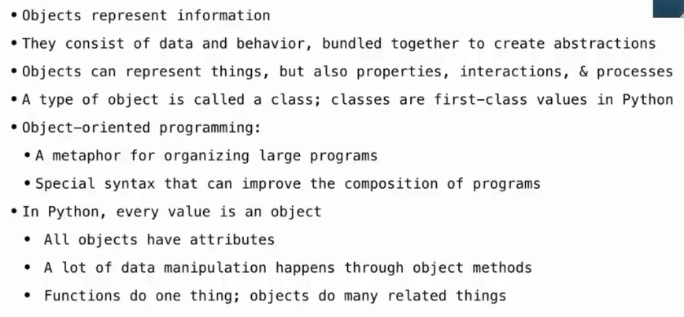
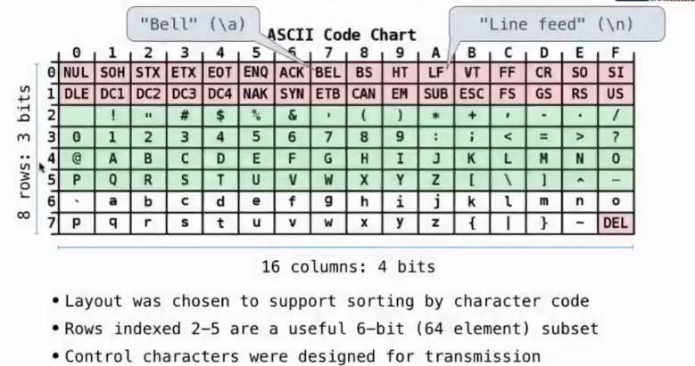
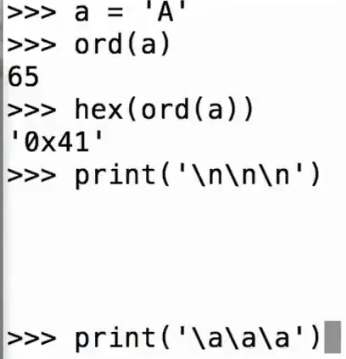
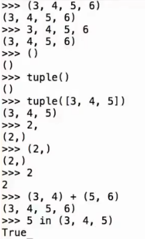
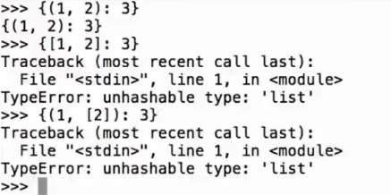

# Lec15-Mutability

# Mutability
## date


## Obj in Python


## String
```Python
s = "Hello"
s.swapcase() # "hELLO"
```
### ASCII

和表格对应

0x41 --> row 4, col 1 :open_mouth:

```python
from unicodedata import name, lookup
name('A') # 'LATIN CAPITAL LETTER A'
lookup('LATIN CAPITAL LETTER A') # 'A'
lookup('SNOWMAN') # '☃'
lookup('FACE WITH TEARS OF JOY').encode('utf-8') # '😂'.encode('utf-8')
```

## Mutation operations
### Mutable objects
- List
- Dictionary
- Set?
```python
# List, pop, remove, append, extend
lst = [1, 2, 3]
lst.pop() # 3
lst.remove(2) # [1]
lst.append(4) # [1, 4]
lst.extend([5, 6]) # [1, 4, 5, 6]
```
赋值的时候，如果是可变对象，则会影响到原对象，如果是不可变对象，则会创建新的对象。 :open_mouth:

### Immutable objects
- Tuple
- String
- Number



Immutable objects are hashable, which means that they can be used as keys in dictionaries and as elements in sets.



An immutable object can be changed if it contains a mutable object.
```python
s = ([1, 2], 4)
s[0][0] = 8 # correct
s[0] = 5 # incorrect
```

## Mutation
### same or change?
- Identity: `a is b`
`is` in Python

- Equality: `a == b`
`==` in Python

```python
def f(s=[]):
    s.append(1)
    return s

f() # [1]
f() # [1, 1]
f() # [1, 1, 1]
```
frame里面引用传递更加常见 :thinking:


