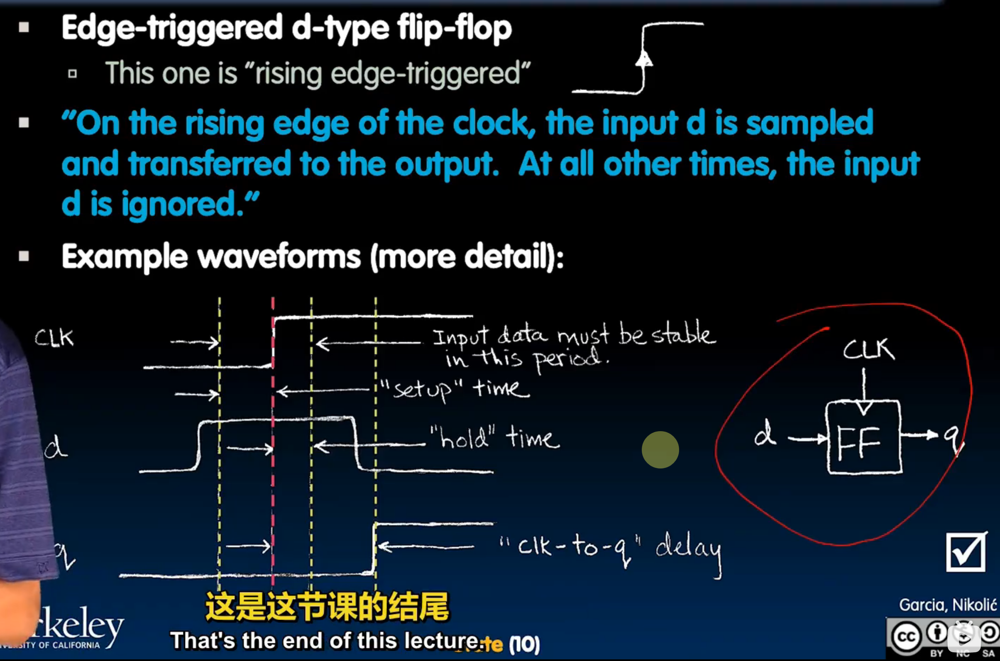
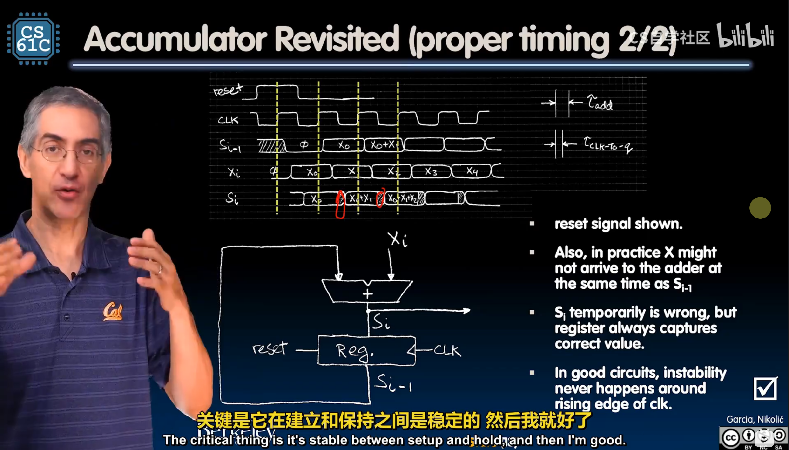
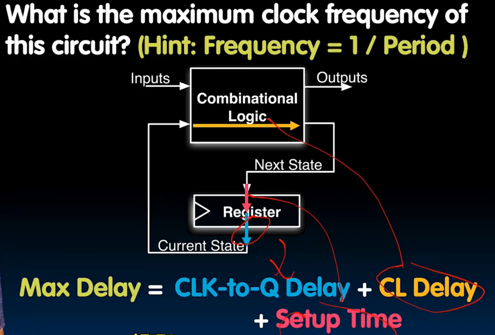
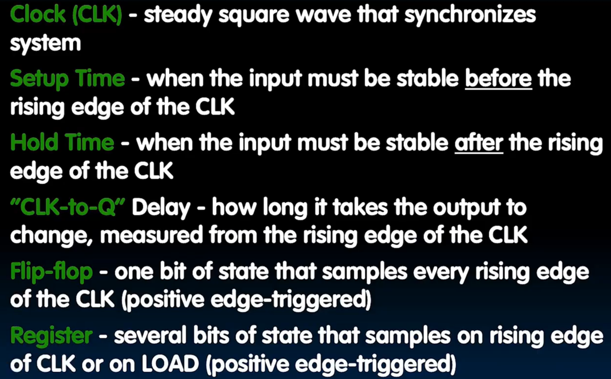
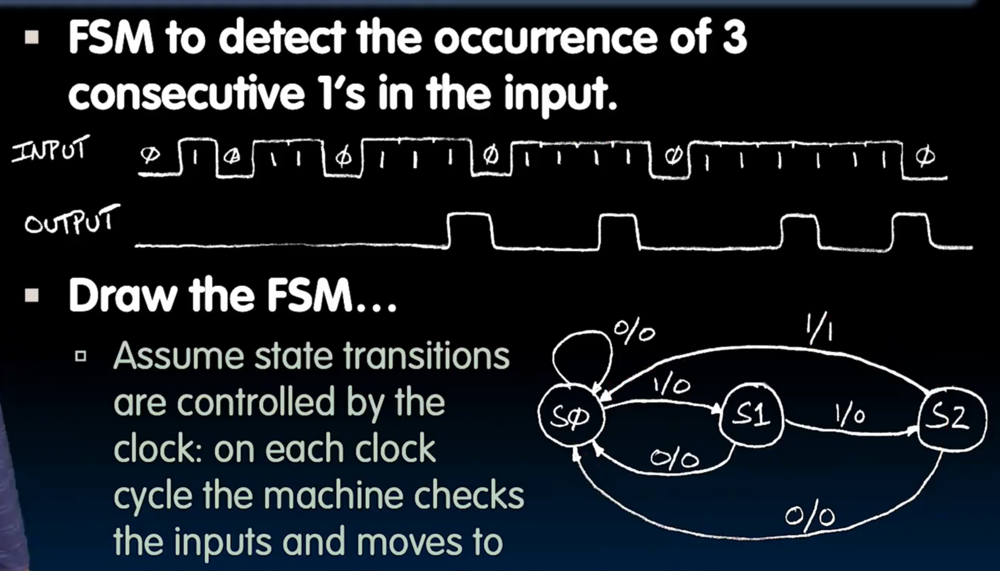
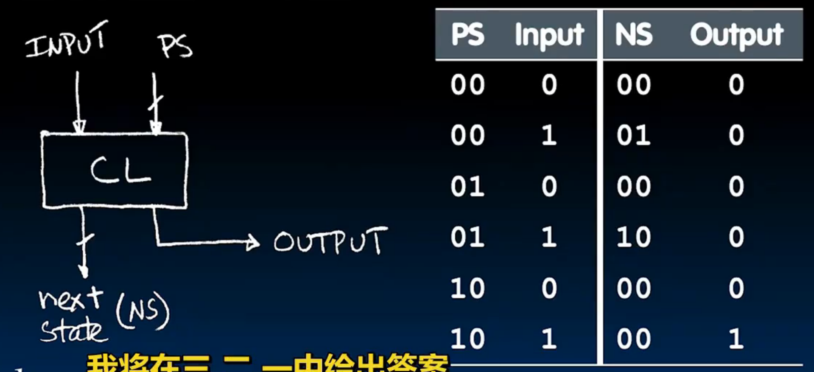

# Lec15-State and State Machines

# Lecture 15: State and State Machines
https://www.learncs.site/resource/cs61c/lectures/lec15.pdf

## Flip-flops? details of registers!
n位寄存器，n个并行的1位触发器

### timing of flip-flops

clk to q 越小越好
## Accumulators revisited

如果超频...

## pipelines and pipelining
### max clock frequency

简单总结 感觉数电知识更多一点？

减少延时
## Finite State Machines

一个例子

等价翻译

