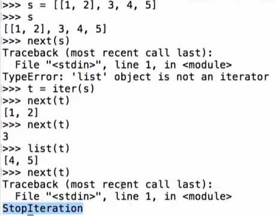
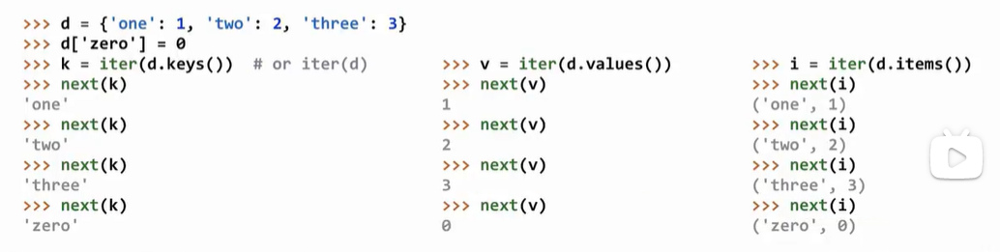
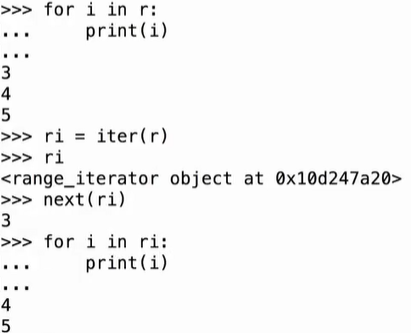
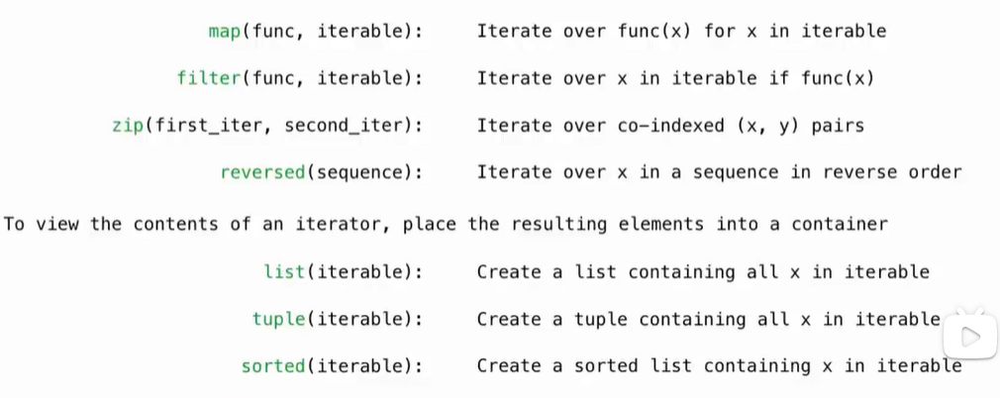
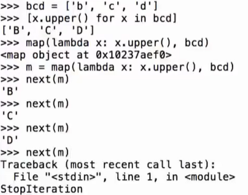
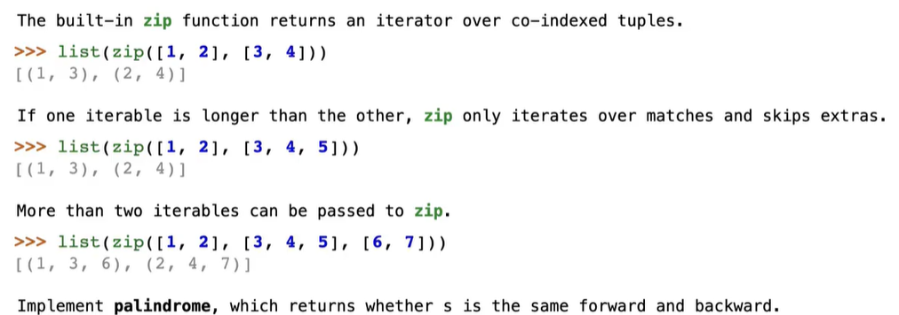
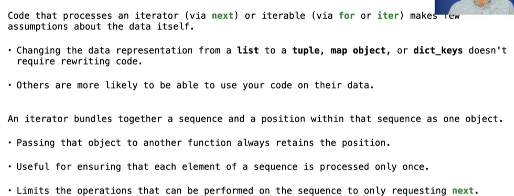

# Lec16-Iterator

# Iterator 

```python
iter(iterable)
next(iterator)
```

## List


`list(iterator)` 创建一个新的列表，包含迭代器中的所有元素

## Dictionary
values, keys, items can be iterated using `iter()` and `next()` functions




迭代的时候不要改变字典的结构（长度），否则会导致迭代出错


## for r in range...




if use iterator in for statement, it will not be able to use again, because it will be exhausted after first iteration

## built-in functions in Python

LAZY MODE:

map / filter / zip / reversed


### map / filter


filter see data100 :yum:

### zip



unpack the zip object into multiple variables(can be useful!)


## why Iterator?



