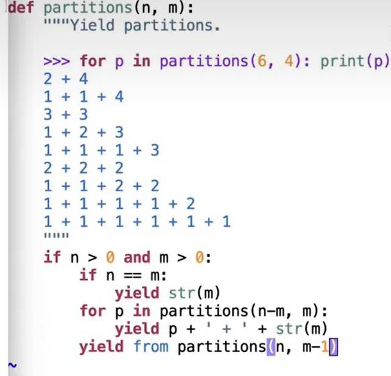

# Lec17-Generators

# Generators

a kind of special iterator!

## yield
```python
def count_to(n):
    for i in range(n):
        yield i

for i in count_to(5):
    print(i)


t = count_to(5) #   t is like a generator object at <generator object count_to at 0x000001>
print(next(t))
```


## Generator vs Iterator

`yield from` is a new syntax in Python 3.3 that allows you to delegate iteration to another generator.


```python
def countdown(k):
    if k > 0:
        yield k
        yield from countdown(k-1) # element-wise iteration of the sub-generator

for i in countdown(5):
    print(i)

list(countdown(5)) # [5, 4, 3, 2, 1]
```


## Example: 




