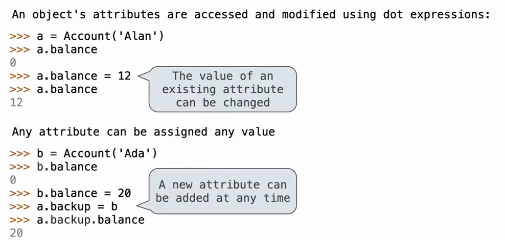

# Lec18-OOP

# Object-Oriented Programming

## class
```python
class MyClass:
    def __init__(self, x, y): # constructor
        # instance variables
        self.x = x
        self.y = y
 
    def my_method(self): # non-static method
        print(self.x, self.y)
    
    @staticmethod
    def my_static_method(x, y): # static method
        print(x, y)
```



Python uses dynamic typing...... :yum:

Binding an object to a new name does not create a new object. It creates a new reference to the same object.

