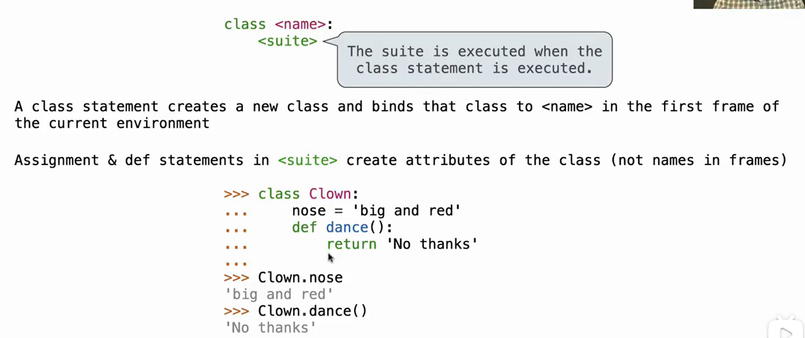
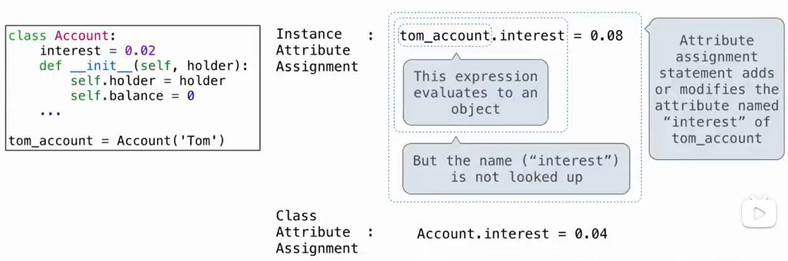

# Lec19-Attributes

# Attributes

## class attribute
```python
class MyClass:
    x = 10
    def __init__(self):
        self.y = 20

print(MyClass.x)  # 10
```



like static member variables


### getattr and hasattr

```python
class MyClass:
    x = 10
    def __init__(self):
        self.y = 20

print(getattr(MyClass, 'x'))  # 10
print(hasattr(MyClass, 'z'))  # False
```

## assignment to attributes



如果重名，先查看实例的属性

## Function calls in class
bound method

```python
class MyClass:
    def __init__(self, x):
        self.x = x
    def my_method(self):
        print(self.x)

obj = MyClass(10)
obj.my_method # <bound method MyClass.my_method of <__main__.MyClass object at 0x000001E8D7D7D708>>
```

why bound? because the method is bound to the instance of the class, so it is filled with the *self* parameter


