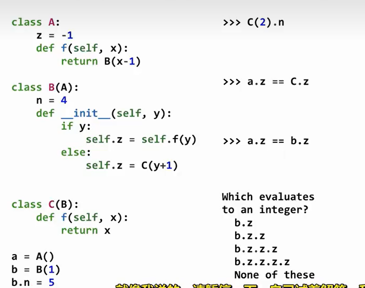
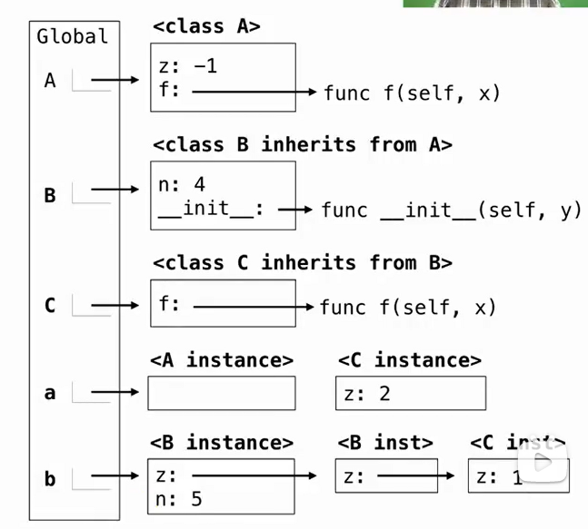

# Lec20-Inheritance

# Inheritance

## Object-Oriented Design

代码复现！





注意instance属性可以随时更改,look at the instance, then the subclass before looking at the superclass

## Multiple Inheritance
```python
class A:
    def __init__(self, x):
        self.x = x

class B:
    def __init__(self, y):
        self.y = y

    def __str__(self):
        return f"B(y={self.y})"

class C(A, B):
    def __init__(self, x, y):
        super().__init__(x)
        self.y = y

    def __str__(self):
        return f"C(x={self.x}, y={self.y})"

    def f(self):
        return self.x + self.y

c = C(1, 2)
print(c)
print(c.f())
```


