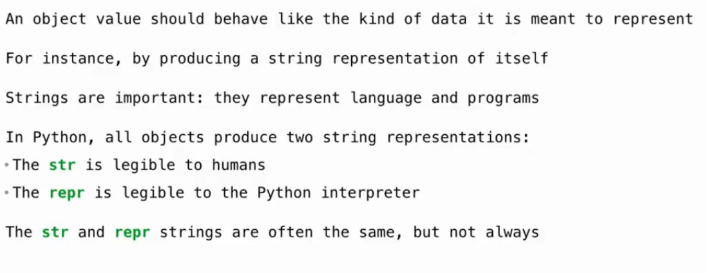
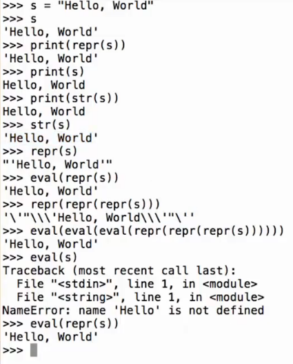

# Lec21-Representation

# Representation

## Strings

一个是Python表达式（解释器可以直接运行的形式），一个是字符串（人类可读的形式）

### repr


```python
>>> s = 'hello'
>>> print(repr(s))
'hello'

>>> repr(min)
'<built-in function min>'
```
### str

```python
>>> from fractions import Fraction
>>> half = Fraction(1, 2)
>>> print(half) # calls __str__
1/2
>>> repr(half) # calls __repr__
'Fraction(1, 2)'
>>> eval(repr(half)) # creates a new Fraction object
Fraction(1, 2)
```



## F-Strings
`{ }`里面的按照表达式来计算
````python
>>> x = 10
>>> y = 20
>>> f"x + y = {x + y}"
'x + y = 30'
````


## 多态函数

Functions that apply to many different forms of data...

```python
>>> half.__repr__()
'Fraction(1, 2)'
>>> half.__str__()
'1/2'
```


实现 `__repr__` 和 `__str__` 方法
- `__repr__`: Only class attributes are found! Ignore instance attributes.
- `__str__`: Ignore instance attributes. If no `__str__` method is defined, it will use `__repr__` method.

```python
def repr(obj):
    return type(obj).__repr__(obj)
```

## Interfaces
类似61B的课程，实现接口（长得像是`__xx__`）

喜欢Java :yum:


### special methods

群 贤 毕 至

终于和cmu 10-414对上了


左右值


