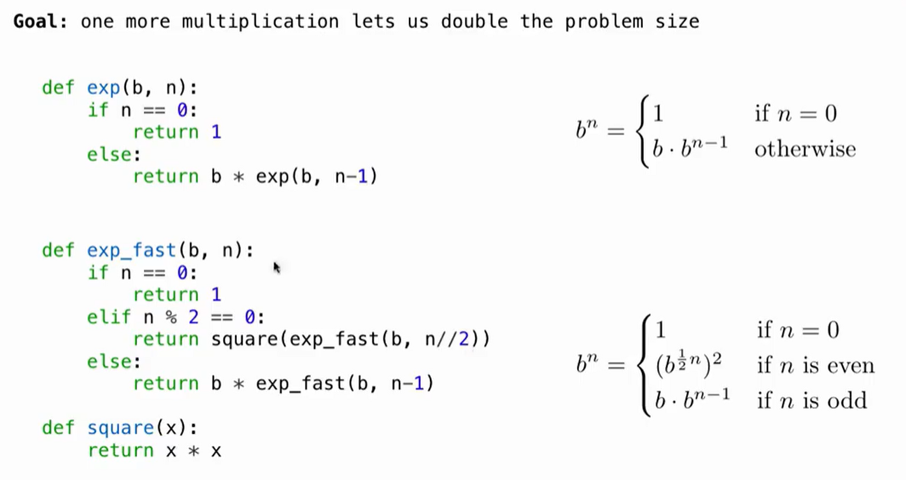

# Lec23-Eifficiency

# Efficiency

## Memorization

Idea: Memorize a large set of information and use it to quickly recall it.
## fib
```python

def memo(f):
    cache = {}
    def memoized(n):
        if n not in cache:
            cache[n] = f(n)
        return cache[n]
    return memoized
```

## Exponentiation


前者 O(N) ，后者 O(logN)

## 省流
CS61B前瞻，对时间复杂度和空间复杂度初步探索


