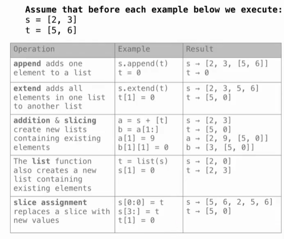
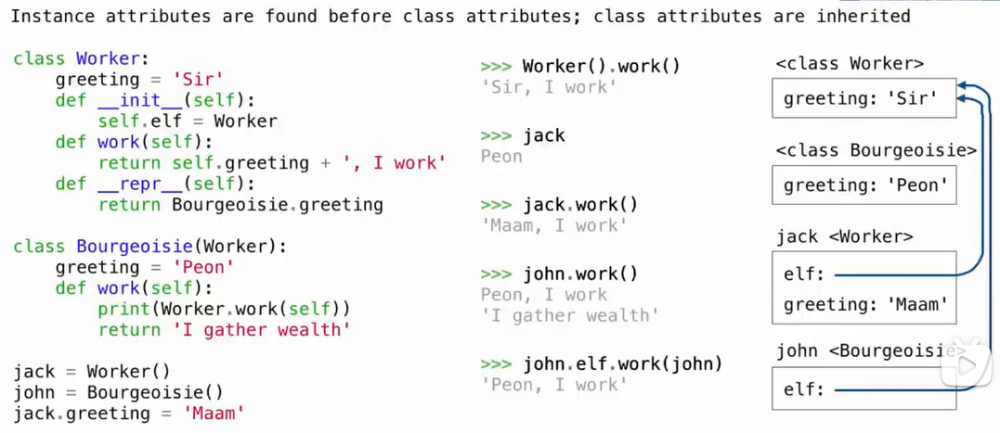

# Lec25-Data Examples

# Data Examples

## Lists in Environment Diagrams



注意：**切片** or **addition** 是引用，而不是复制，有时候可能不经意改变

```python
>>> t = [1,2,3]
>>> t[1:3] = [t]
>>> t.extend(t)
>>> print(t)
[1, [...], 1, [...]]
```

在Python中，当你尝试打印一个包含自身的列表时，列表无法递归地打印出所有的元素，因为它会无限循环地引用自己。为了避免这种无限循环，Python会用[...]来表示列表中被省略的部分。

## Obj Systems in Python

- return a string -> `'str'`, print a string -> `str`

- `.some_attr`: can create a new attribute for the instance at once, or get the value of an existing attribute


## Iterators and Iterables in Python

training test
```python

def digit_dict(s):
    """
    >>> digit_dict([5, 2, 13])
    {2: [2], 3: [13], 5: [5]}
    """
    last_digit = [x % 10 for x in s]
    return {d: [x for x in s if x % 10 == d] for d in range(10) if d in last_digit}
```


`.count()` method:
- <built-in method count of list object at 0x000001>
- `[1 for x in range(10) if ...]` 计数


