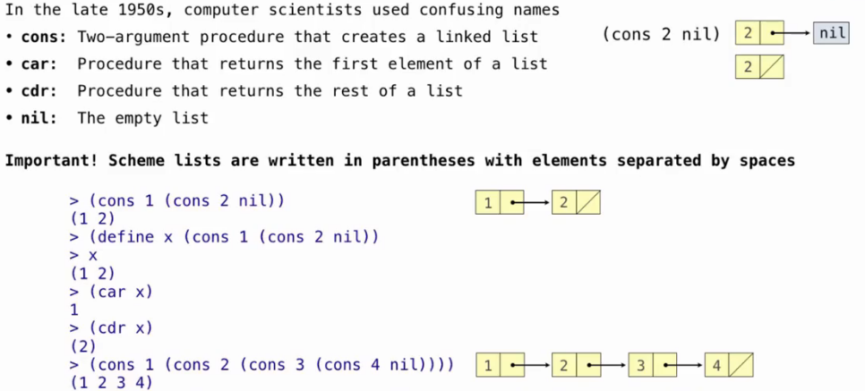
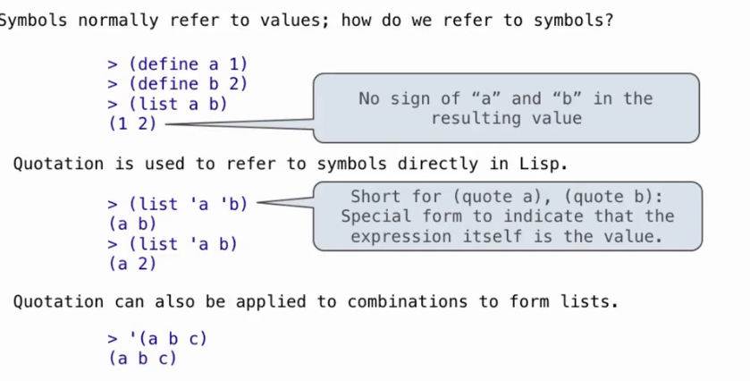
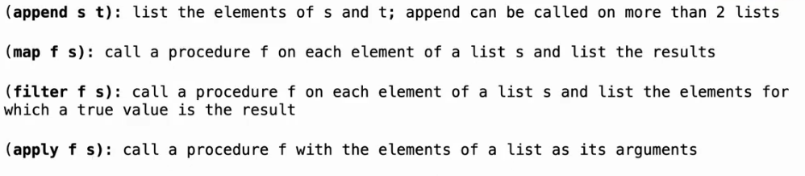
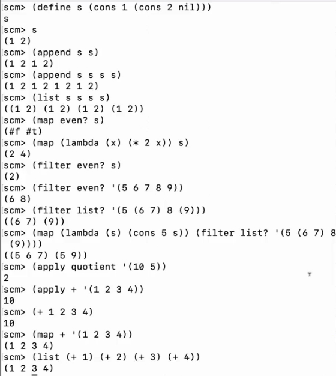
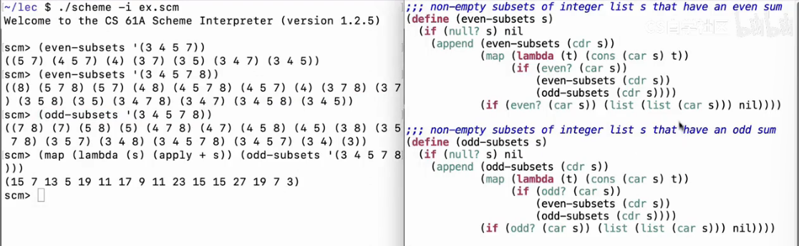
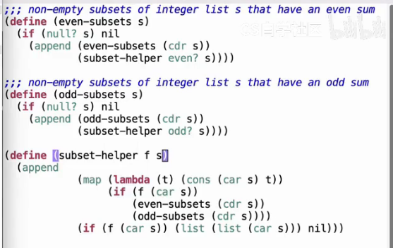
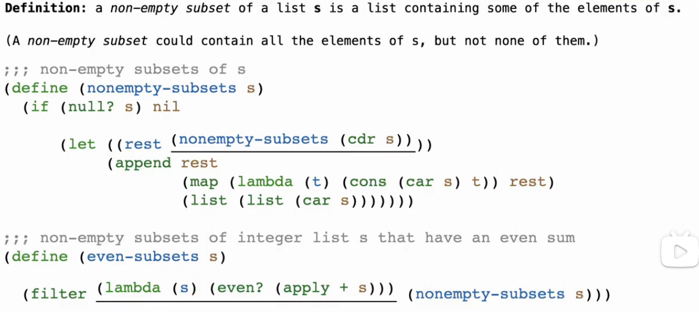

# Lec27-Scheme Lists

# Scheme Lists

## cons / car / cdr / nil



```scheme
(null? nil) ; #t
(null? (cons 1 nil)) ; #f
(car (cons 1 2)) ; 1
(list 1 2 3) ; (1 2 3)
```

## Symbolic Programming

Lisp is a symbolic programming language, which uses in AI for a long time...?

  

注意单引号
```scheme
(car (cdr (car (cdr '(1 (2 3) 4))))) ; 3
```

## List Processing




纯看scheme属实有点抽象了



helper function 化简之



进一步化简



语法稍微了解一些，似乎interpreter才是重点 :thinking:


