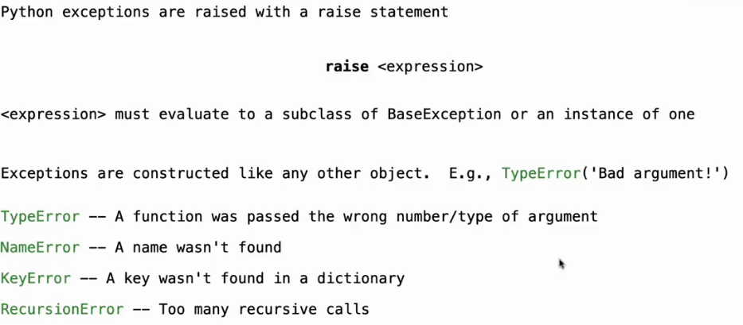

# Lec28-Calculator

# Calculator

## Exception



```python
raise Exception("Invalid input")
```

```python
try:
    # code that may raise an exception
except Exception as e:
    print(e)
```
见java try-catch :smirk:

```python
float('inf') # positive infinity
float('-inf') # negative infinity
```

## Programming Languages
- Programs are trees... and the way interpreters work is through a tree recursion.


## Parsing

把文本转化为抽象语法树（Abstract Syntax Tree，AST）

base case: only symbols and numbers

recursive case: expressions and statements

## Scheme-Syntax Calculator


using Python `Pair` to describe pairs of expressions and statements
### the eval function


```python
def calc_apply(op, args):
    """
    args: Iterable
    """
    if op == '+':
        ...
    elif op == '-':
        ...
    elif op == '*':
        ...
    elif op == '/':
        ...
    else:
        raise Exception("Invalid operator")
```

### interactive cli
Read-Eval-Print-Loop (REPL) :open_mouth:


### raise exception


