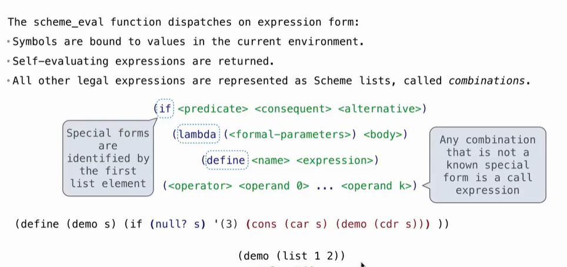
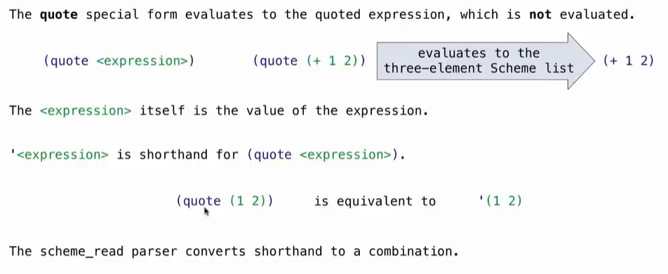
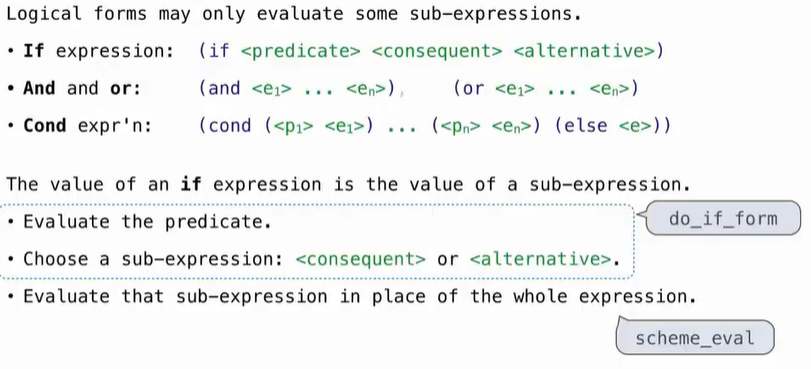
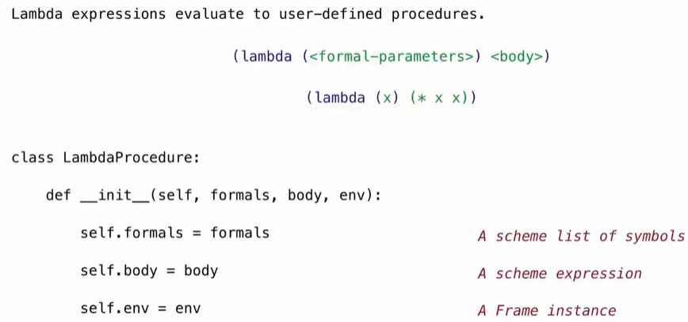
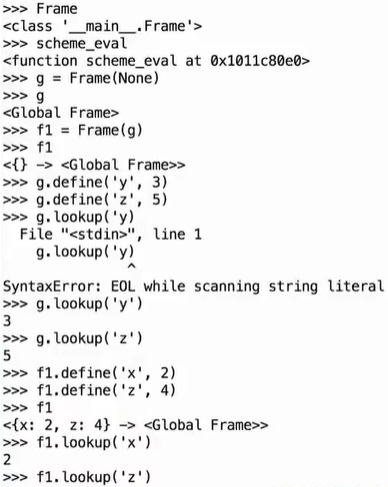
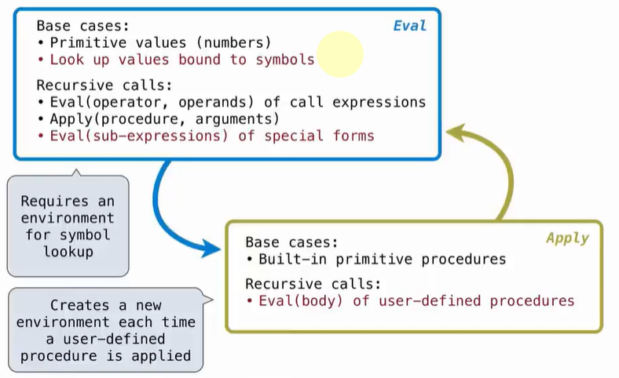
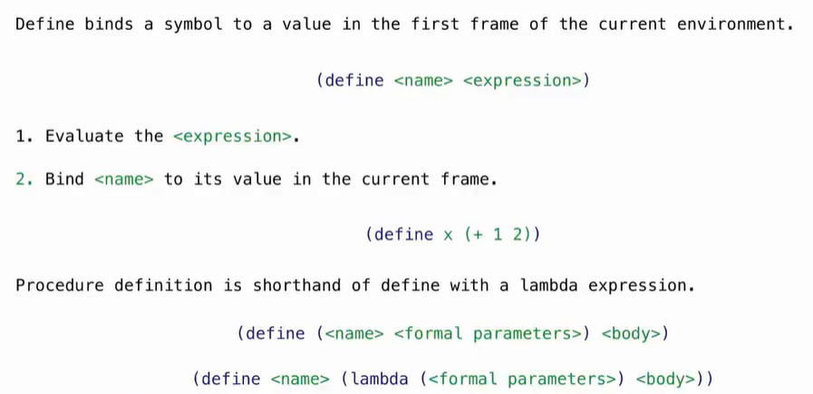

# Lec29-Interpreters

# Interpreters

## Special Forms


## Quotation


## Logical Forms


## Lambda Expressions
```scheme
(lambda (x) (+ x 1))
```


## Frame and Environment


## Dynamic Scope    
who calls you can provide the value you need

rather than static scope...

## Interpreting Scheme Code
核心在此


## Define Expressions



