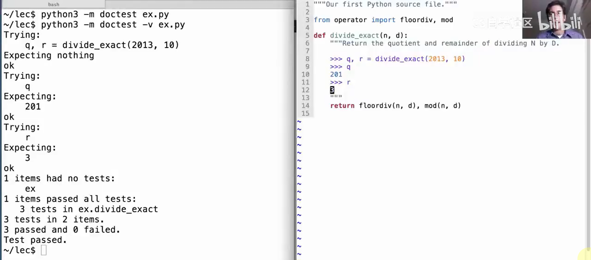

# Lec3-Control

# Control

## div in Python
```python
from opertor import truediv, floordiv
a = 10
b = 3
c = a / b
d = a // b
print(c) # 3.3333333333333335
print(d) # 3
```

## doctest in Python



