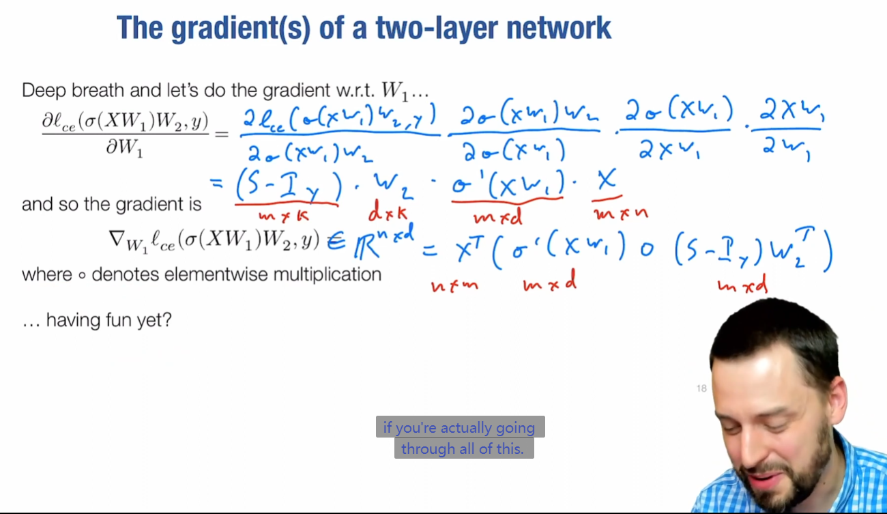

# Lec3-Manual Neural Networks Backprop

# Manual Neural Network I
## 回顾一下通用近似定理

注意事实上多项式、Nearest Neighbor等都是基于通用近似定理的。

## 非线性ReLU函数新理解

画图折线

## 反向传播

no one else can do this awful math happily :grinning:

so here comes the backpropagation algorithm & autograd

潜在的模块化和自动求导:thinking:

