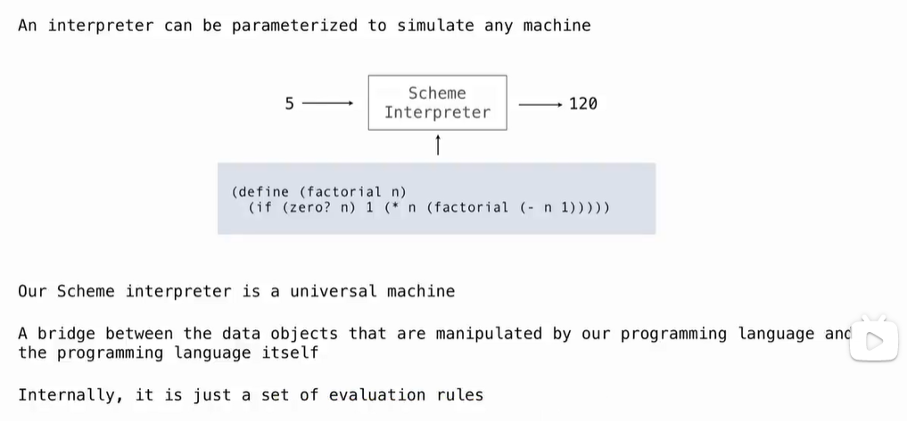

# Lec30-Tail Calls

# Tail Calls

## Functional Programming


## Tail Call
相同时间复杂度，对空间复杂度的限制，常量空间运行


get the len of a list


## Map and Reduce
### Reduce


eg
```scheme
(reduce * '(3 4 5) 2) ; 120
```

### Map
Map with only a constant numbers of Frames


## General Computing Machine

:open_mouth: 




