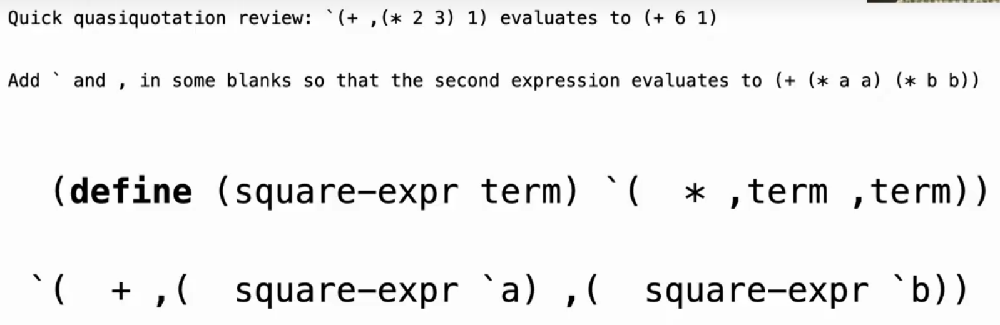
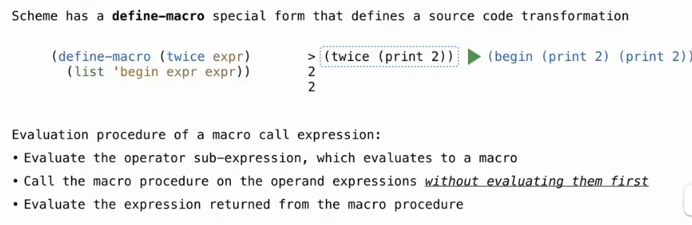
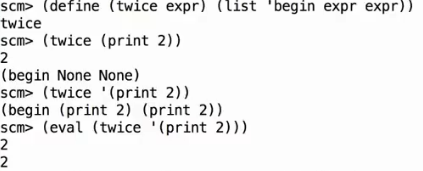
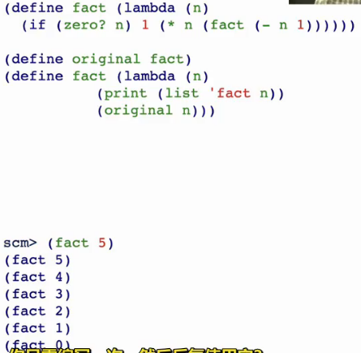
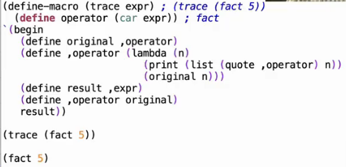

# Lec32-Macros

# Macros

## quote or unquote



在于怎么eval :thinking:

`,` 后面的 `(some_expression)` 不会被quote

## Macros in Scheme
define new special form in scheme...

`define-macro` 定义一个新的宏，接收一个 `<expression>` 作为参数，返回一个新的`<expression>` 并且eval之, 先不对参数eval



注意和define的区别，define在意的是传进来的 **value** 



another example, to show info of your **expression** using macro

```scheme
(define-macro (check expr)
    (list 'if expr ''pass 
        (list 'quote (list 'failed: expr))))
```

## For Macro in Scheme

```scheme
(define (map fn vals)
    (if (null? vals)
        ()
        (cons (fn (car vals))
              (map fn (cdr vals)))))
```

```scheme
> (map (lambda (x) (* x x)) '(2 3 4 5)) ; without using macro case
(4 9 16 25)
```


```scheme
(define-macro (for sym vals expr)
    (list 'map lambda (sym) (expr) (vals)) ;? wrong!
    (list 'map (list 'lambda (list sym) expr) vals))

```

## Trace

```python
def trace(fn):
    def traced(n):
        print(f"Calling {fn.__name__} with {n}")
        return fn(n) # n is fn's argument!
    return traced

@trace
def fact(n):
    if n == 0:
        return 1
    else:
        return n * fact(n-1)

print(fact(5))
```

scheme example, without using macro



with using macro




