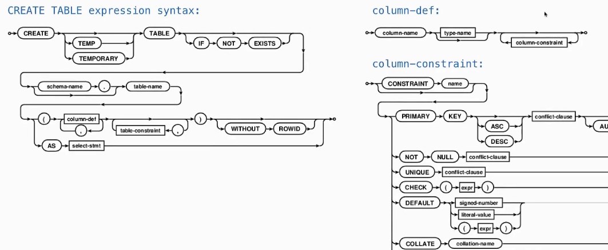
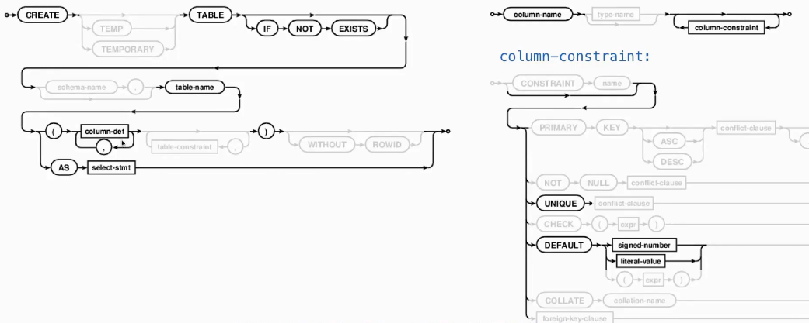
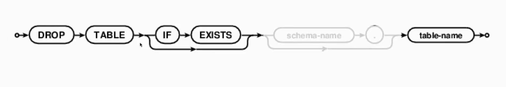
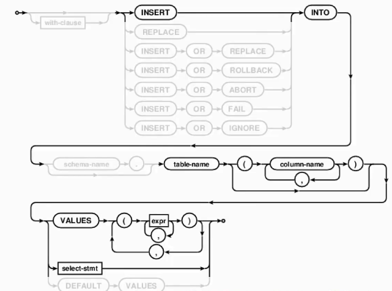

# Lec36-Databases

# Databases

## method of tables
### create and drop tables



:nerd_face:



```sql
create table numbers (n, note);
create table numbers (n UNIQUE, note DEFAULT 'unknown');
```


```sql
drop table if exists t;
```


### insert data into tables

```sql
insert into t values (1, 'one');
insert into t(col1) values (2);
```

### update
```sql
update t set col1 = 3 where col2 = 'two';
```

### delete

```sql
delete from t where col1 = 1;
```

## Python and SQL

```Python
import sqlite3

# connect to the database
conn = sqlite3.connect('mydatabase.db')

conn.execute('''CREATE TABLE IF NOT EXISTS mytable
               (id INTEGER PRIMARY KEY, name TEXT, age INTEGER)''')

conn.execute("INSERT INTO mytable (name, age) VALUES ('Alice', 25)")
# a cursor object is used
conn.commit() # save changes into db file
```

## database connection

一个db可以被多个程序连接操作 :yum:


