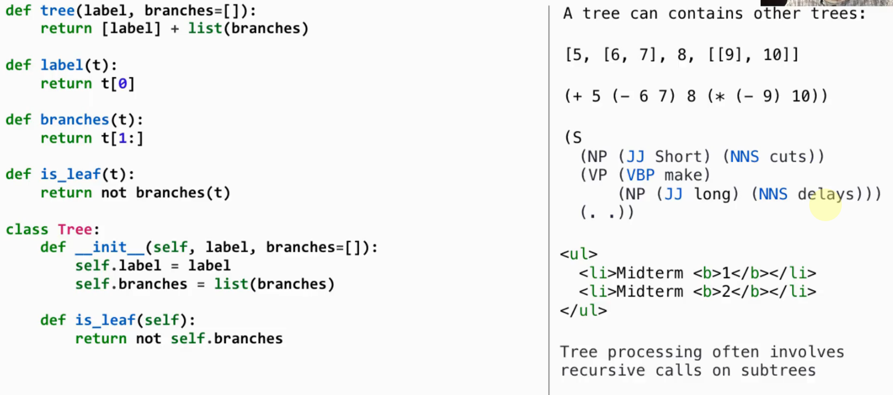
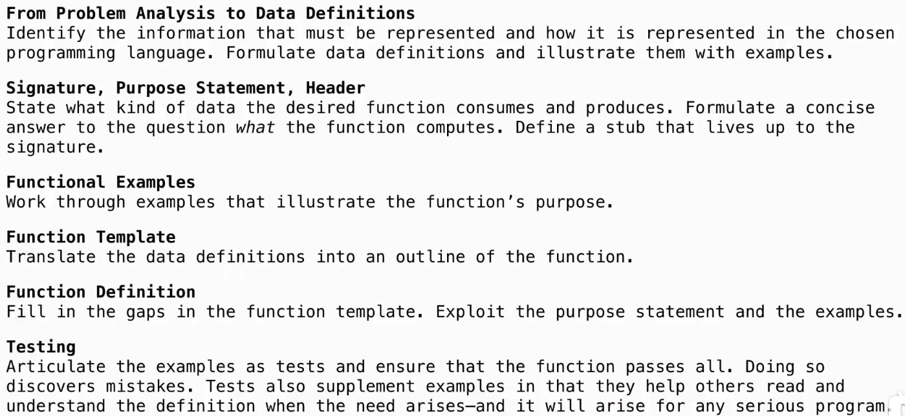

# Lec37-Final

# Final Project: The Game of Life ? 
*about the title: well, umm, this title just pop up in the **cursor** and I don't mean to write that...*

*it just feels like a good idea to write something about the game of life ==> 61B or 61C must have a project on this topic :thinking:*

## Trees

### Processing

**def里面def的风格感觉是CS106里面提到的递归helper function的风格** :open_mouth:

## Recursive Accumulation

using ***static*** variables to accumulate the results of recursive calls :open_mouth:

## how to design a Function?

example driven

:tada: summer went away, stillness stayed :tada:

