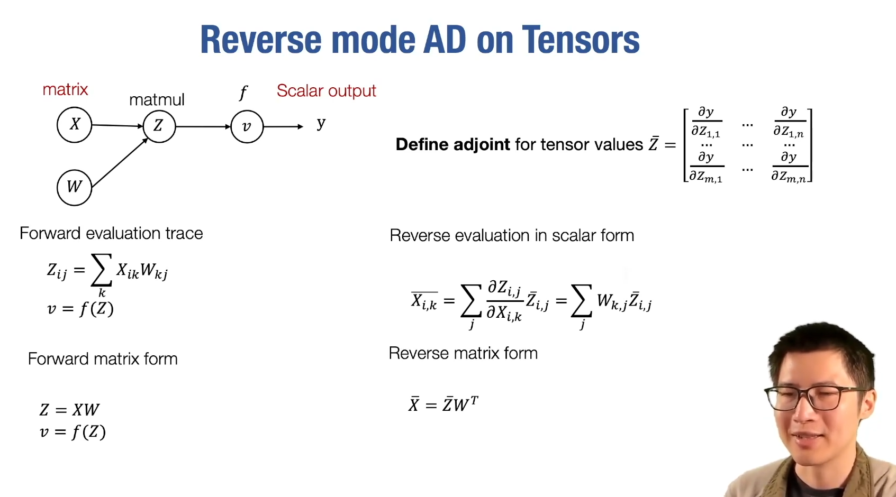

# Lec4-Automatic Differentiation

# Automatic Differentiation
## 数值微分

希望误差阶数为 $O(h^2)$

事实上并非采取这种方式计算，只是用来test

side note:
- $\delta^T$ : pick a small vector $\delta$ from unit ball
- $\nabla_{x} f(x)$ : gradient of $f(x)$ at $x$, 通常是其他方法计算的
- 右手边则是数值计算，然后看两者是否近似相等

## 符号微分
许多重复的的计算与IO，但是可以作为自动微分的引入

## 自动微分
### 计算图
有向无环图（DAG），点包含数值，边表示运算

### 前向模式 Forward Mode AD
#### 算法
遍历图，从输入开始，计算每个节点的输出，然后将结果传播到后续节点

$$
\Large
\begin{aligned}
Define: & \quad v'_{1i} = \frac{\partial v_i}{\partial x_1} \\
\end{aligned}
$$

then compute $v_i'$ iteratively, in the forward topological order

#### 限制

如果n小k大，那么跑很少的pass就可以得到想要的梯度，但是事实上情况相反

### 反向模式 Reverse Mode AD
#### 算法
遍历图，从输出开始，计算每个节点的输入，然后将结果传播到前续节点

$$
\Large
\begin{aligned}
Define\ adjoints: & \quad \bar{v}_{i} = \frac{\partial y}{\partial v_i} \\
\end{aligned}
$$

then compute $\bar{v}_i$ iteratively, in the reverse topological order

感觉BFS和DFS都呼之欲出了，但是DFS更直观一些? BFS更适合计算图的结构? :thinking:

#### implementation

事实上我们在这里是 ***拓展了计算图*** :thinking:

side note: 这里id == identity function，即输入输出相同，只是为了扩展计算图而已

使得我们可以计算任意节点的导数，而不仅仅是输入节点的导数，并且输入节点的值发生变化时，带进去跑一边图即可

### Reverse Mode AD vs Backpropagation

- Gradient of Gradient
- 优化

GPT：
右边的图展示了通过扩展计算图实现的反向模式自动微分（Reverse Mode AD），而这在现代深度学习框架中被广泛采用，相比传统的反向传播（Backprop）方法有一些优势。

主要原因如下：

1. **图结构的优化**：
   - 在反向传播中，后向计算是在前向计算图的基础上复用的（左图）。但是，Reverse Mode AD 会为每个操作的梯度计算生成单独的图节点（右图），从而提供更清晰的图结构，允许更灵活的梯度计算和优化。
   
2. **更易于复杂操作的处理**：
   - 扩展的图结构能够更好地表示复杂操作的梯度计算，尤其是在现代深度学习模型中，这种灵活性使得处理复杂的神经网络结构更加高效。
   
3. **更好的框架支持**：
   - 现代深度学习框架（如TensorFlow、PyTorch等）通常采用这种Reverse Mode AD的方式，因为它能够更好地支持自动微分，尤其是在更复杂的模型训练过程中。反向传播（Backprop）更多被用在早期的深度学习框架中，如Caffe和Cuda-convnet，而这些框架相对已经过时。

总结：右边的方法能够通过构建单独的计算图节点，使梯度计算更灵活和高效，这就是为什么现代深度学习框架更倾向于使用这种方法。

### 拓展到多元函数 Tensors

# Differentiable Programming
推广到数据结构上面去

