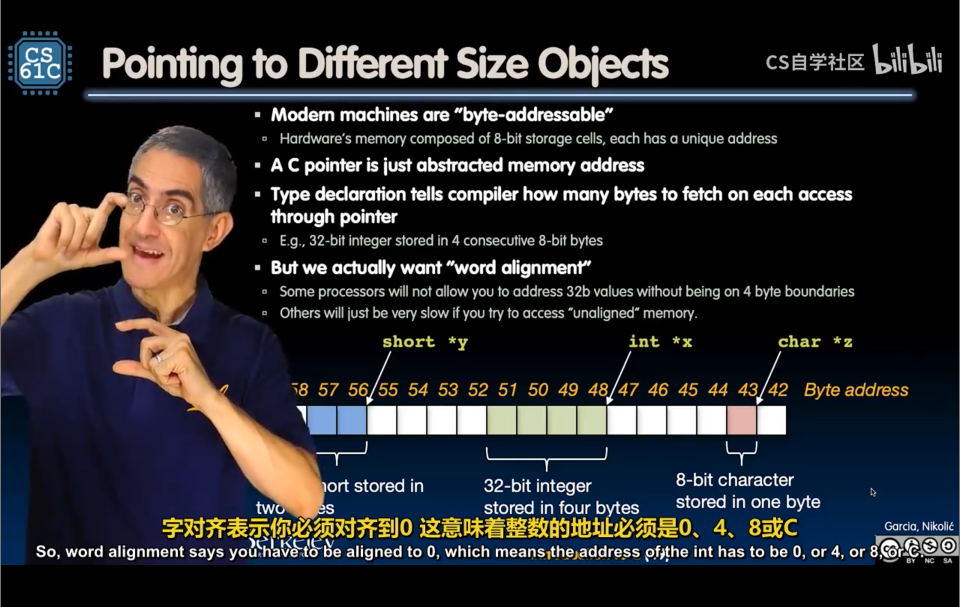

# Lec4-C intro：Pointers, Arrays, Strings

# C intro: Pointers, Arrays, Strings

## Pointers
```c
int (*fn) (void *, void *) = &foo; // pointer to function
```

arrow operator `->` is used to access members of a struct pointed to by a pointer.

`NULL` pointer is used to indicate an invalid pointer.
```c
if (p == NULL) {
    // handle error
}
```

谈到了地址对齐 -> *word alignment*



```c
sizeof(arg)

sizeof(structtype)
```

## Arrays

经典问题之数组名是指针


```c
char *foo() {
    char arr[10];
    return arr; 
    // A BIG mistake! 函数栈回收时，arr指针指向的空间可能被释放掉了，导致程序崩溃
}
```

## Strings
always end with a null character `\0` :wink:

***Segmentation fault*** :s

或许rust可能更安全

## Summary

```c
void incrementPtr(int *p) {
    p += 1;
    // wrong again! have to ...
}

void incrementPtr(int **p) {
    (*p) += 1; // correct
}
```
注意引用传递即可


