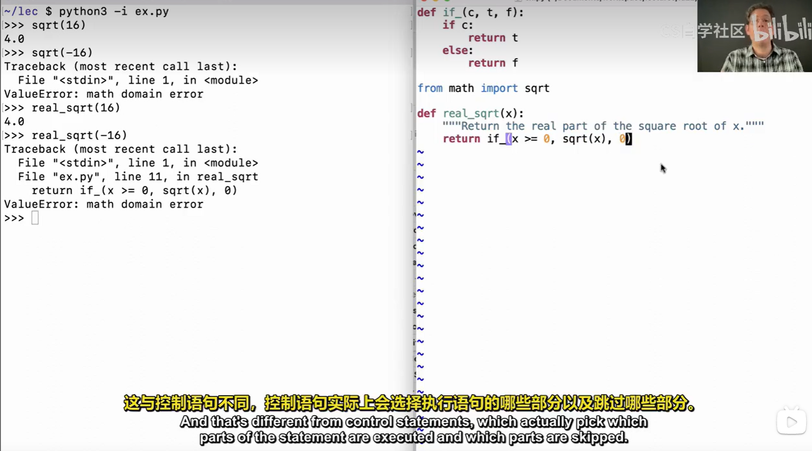
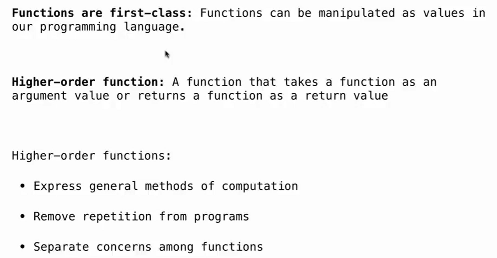

# Lec4-Higher-Order Functions

# Higher Order Functions

## Control Statements vs Functions
all params will be evaluated before the function is called ! 不存在跳过参数的情况



## Assertions in Python
```python
assert condition, message
```

## Returning a Function from a Function
带参数的修饰器 :open_mouth:
```python
def make_adder(n):
    def adder(x):
        return x + n
    return adder

# Example usage
add_three = make_adder(3)
print(add_three(4))  # Output: 7, WHY?
```



functions in Python are ***first-class values***!

