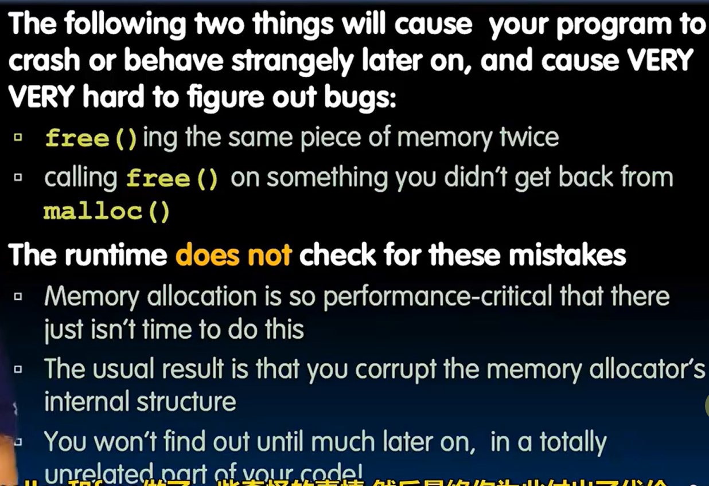
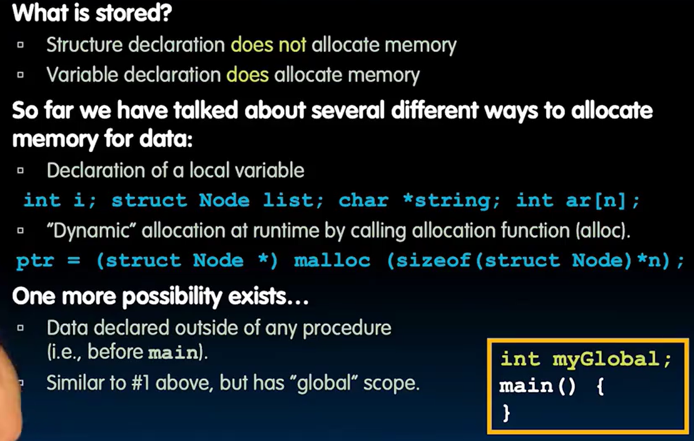
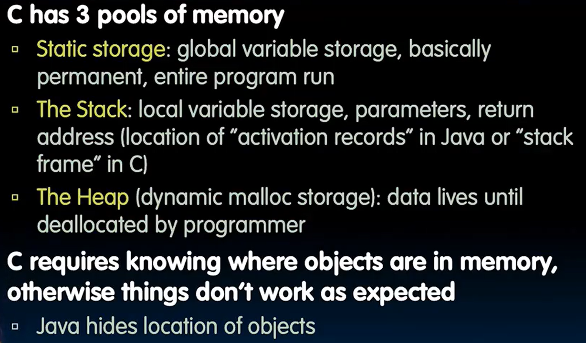
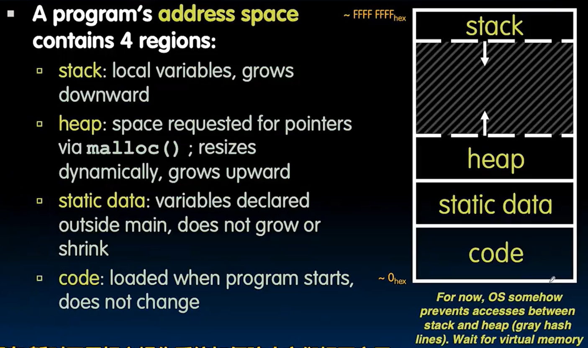
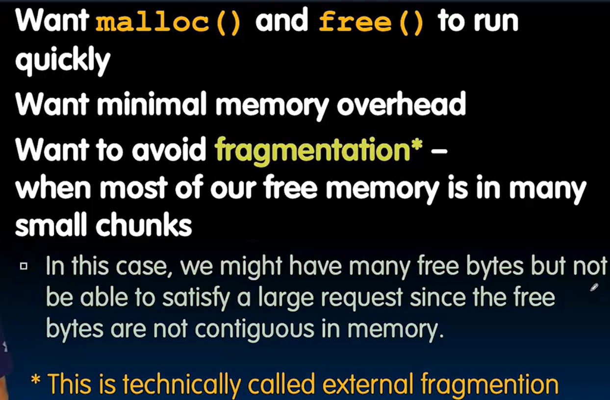
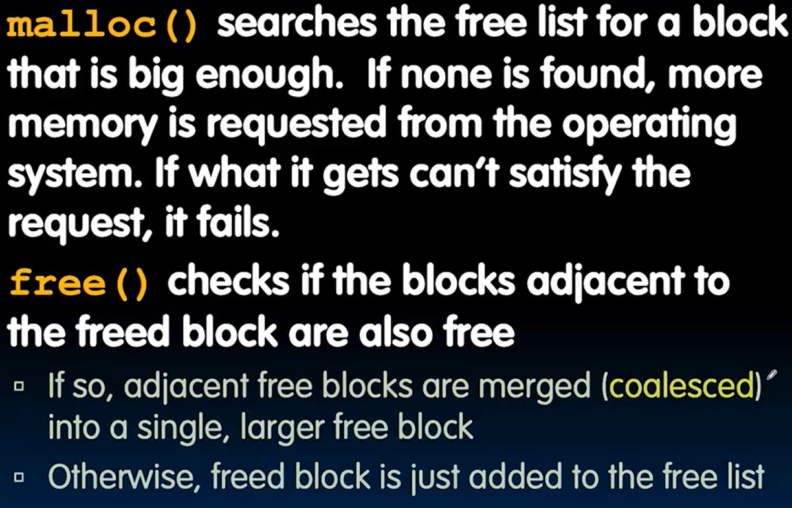
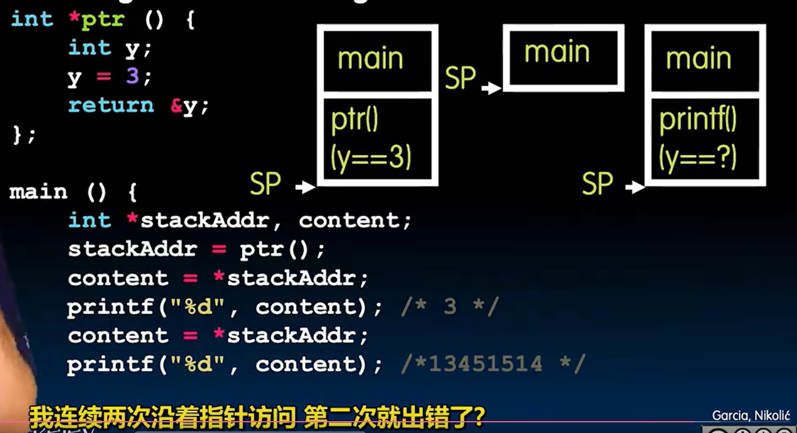
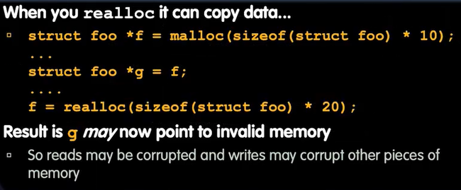

# Lec5-C Memory Management

# C Memory Management
## malloc
```c
// with the help of a typecast and sizeof 
ptr = (int *) malloc(n * sizeof(int));
/* check if malloc was successful */
if (ptr == NULL) {
    /* handle error */
}
```

```c
ptr = (int *) realloc(ptr, (n+1) * sizeof(int));

free(ptr); // realloc(ptr, 0)
```

不要踩坑！



***An array name is not a variable. -- K&R***

when call `&arr` , just get the address of the first element of the array


## Linked List Example
```c
struct node {
    char *data;
    struct node *next;
};
typedef struct node *List; // 定义 List 为 struct node 的指针类型

List create_empty_list() {
    return NULL;
}
```


## Memory Locations

分配内存的方式



三个存储池



栈的映像图 LIFO



## Memory Management 

stack, static memory are easy to handle, but heap is a bit more complicated...



### Implementing malloc and free



## When Memory Goes Bad
- 不要轻易的访问栈区指针 / 地址



- 忘记`realloc`会移动数据



- 移动指针但是胡乱free or double free :exploding_head:

## Valgrind?
- Valgrind is a tool for detecting memory errors in C and C++ programs.

## 

