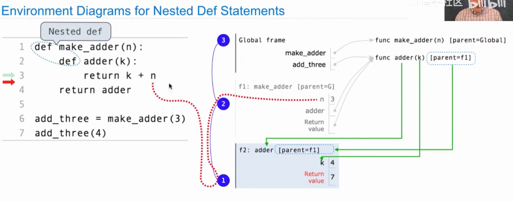
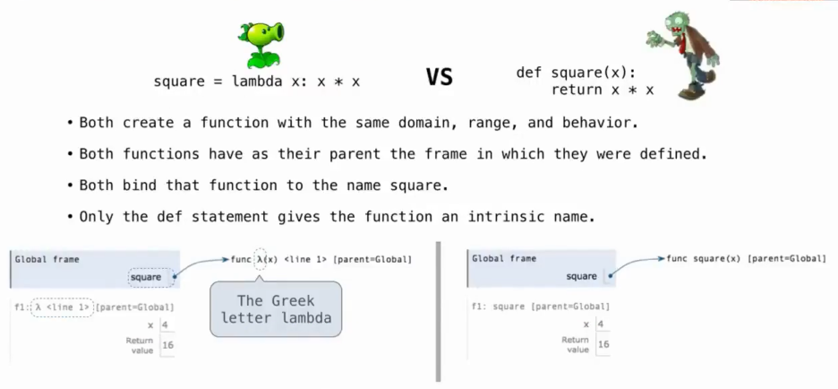

# Lec5-Environments

# Environments

## Nested Environments in Python


注意环境追溯的顺序，从内到外


## Lambda Functions
函数式编程的核心思想是抽象和函数式编程，lambda函数是一种匿名函数，可以把函数作为参数传递给其他函数，或者作为返回值返回

```python
f = lambda x: x + 1
print(f(1))  # Output: 2
print((lambda x: x + 8)(1))
```

### 和def函数的区别



## Function Currying

Currying: transforming a multi-argument function into a single-argument, higher-order function.

```python
def curry2(f):
    def g(x):
        def h(y):
            return f(x, y)
        return h
    return g

# Another example

curry2b = lambda f: (lambda x: (lambda y: f(x, y)))

```


