# Lec6-Floating Point

# Floating Point
## Introduction
note that binary can directly calculate

we can use normal format to represent floating point numbers

eg: $1.xxxxx * 2_{two}^{yyyyy}$

"1."默认，不需bit级别上考虑

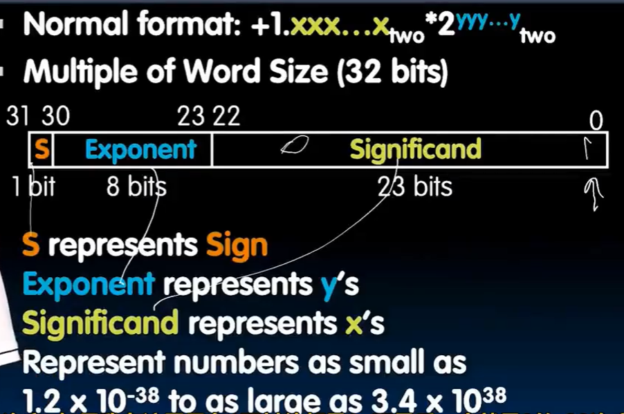

## underflow & IEEE 754
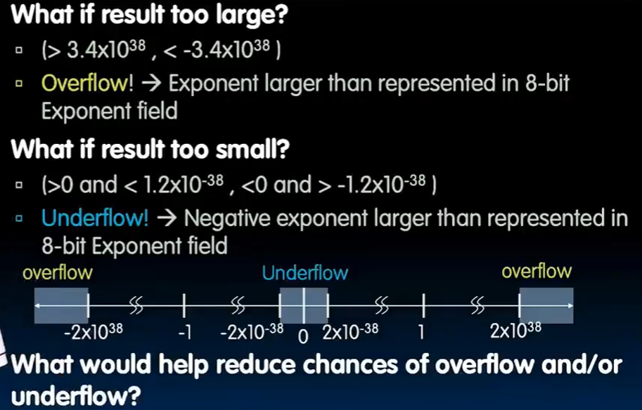

希望全是0的bit表示的是最小的数字，而不是+0或-0，引入bias

$bias = 2^{n-1} - 1$ 详见number representation的bias部分

真正的表示方法：

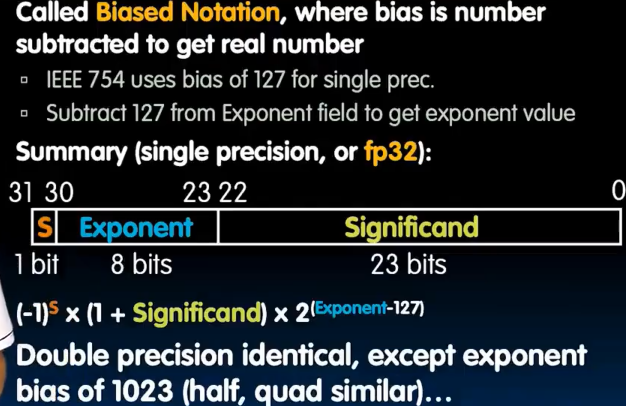

IEEE 754 :tada: 


## Special Values
infinity, NaN, zero

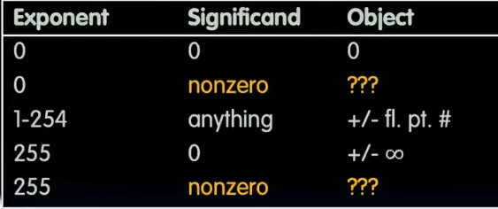

- NaN (Not a Number) : 无效数值，如0/0, sqrt(-1)
- infinity : 无穷大，如1/0, 10^1000
- zero : 零，如0/1, 1.0-1.0

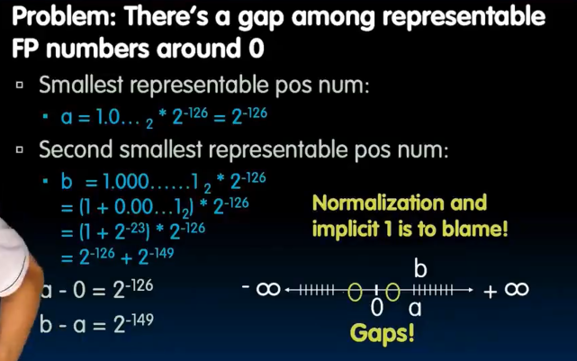

gap数量级在800万左右，因为implicit one的出现

- denormalized number : 规格化数值，指数部分为0（**implicit 2^-126**），小数部分不为0==> 从步长2^-149开始，exp加1，步长翻倍，同时从denorm到norm的时候步长不会发生变化！


总结

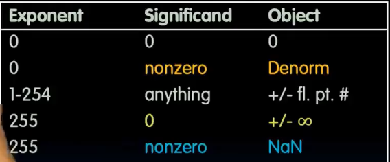

从0 11111110 111...11(23个) 加一，得到 0 11111111 000...00(23个)这就是无穷

one more step, 0 11111111 000...00(23个)加一，得到 0 11111111 000...01(23个)这就是NaN（一大片都是NaN）

1应该是 0 01111111 000...00(23个) :yum:

1, 2, 4, 8, 16, 32...之间都是800万个左右数字，某一刻开始间隔1计数 :smirk:

## example and discussion
### example 
- $\frac{1}{3} = $ 0 01111101 010101...0101(共23个) 

### discussion
FP add associative law: $a+b+c = (a+b)+c$ ?

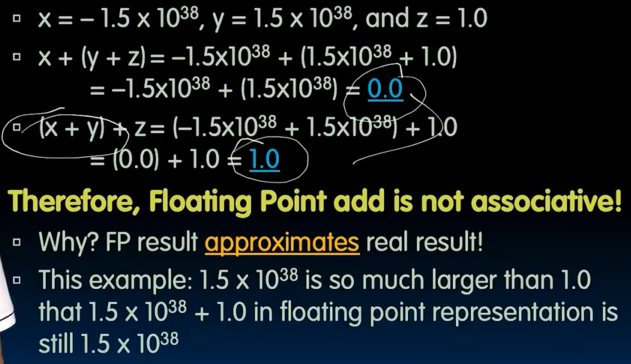
#### precision and accuracy
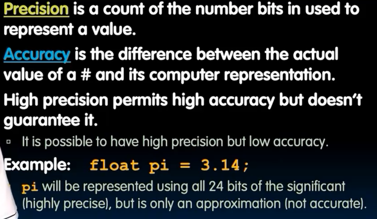

#### rounding
向上 / 向下 / 四舍五入 / 截断

#### add
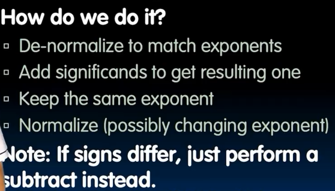

#### casting
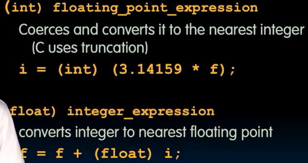

```c
// most large integers do not have exact representation in float
if (i == (int)((float)i)) {
    prtinf("true"); // not always true
}
```

```c
if (f == (float) ((int)f)) {
    printf("true"); // not always true, eg: 1.5
}
```

## other representation
double precision float (64 bits)

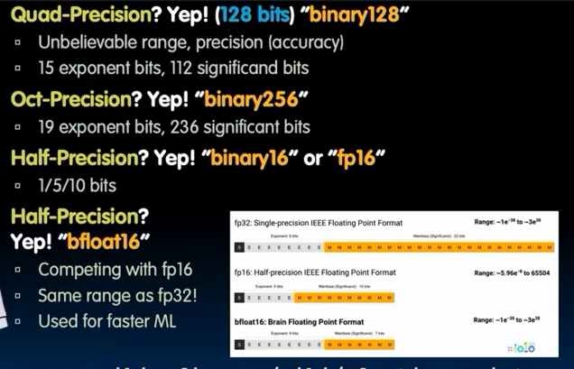

加速器所支持的格式
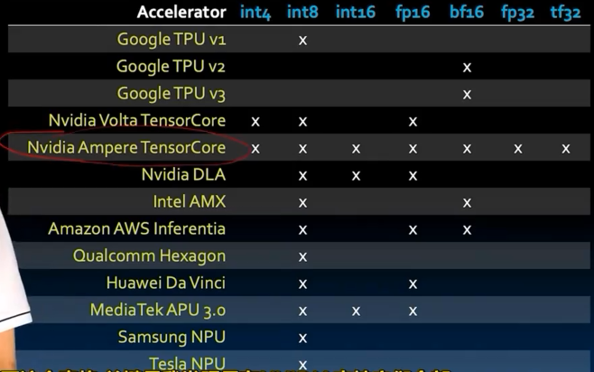

