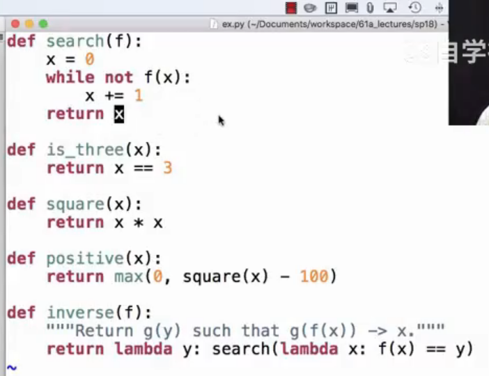

# Lec7-Functional Abstraction

# Functional Abstraction

## which a ?

```python
a = 1
def f(g):
    a = 2
    return lambda y: a * g(y) # a is 2

f(lambda y: a + y)(a) # a is 1

```

## Return



求反函数整数点的解法，有意思记录一下


## Abstraction

在python里面函数的内在名称(intrinsic name)用于用户识别而已


