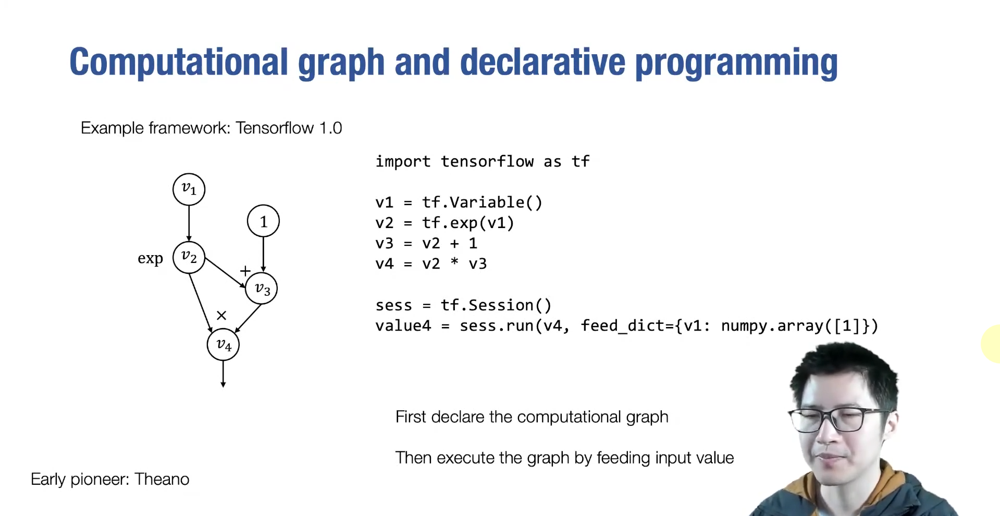
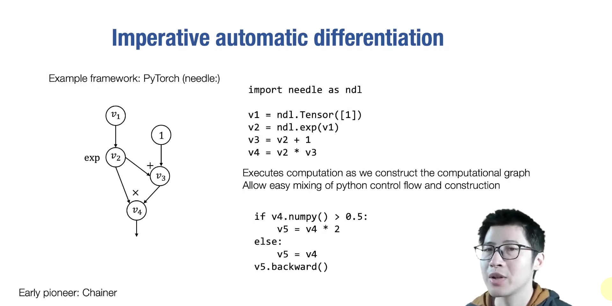
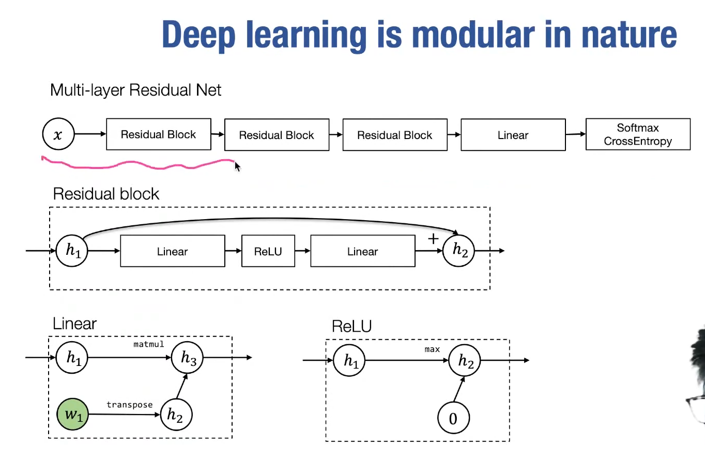
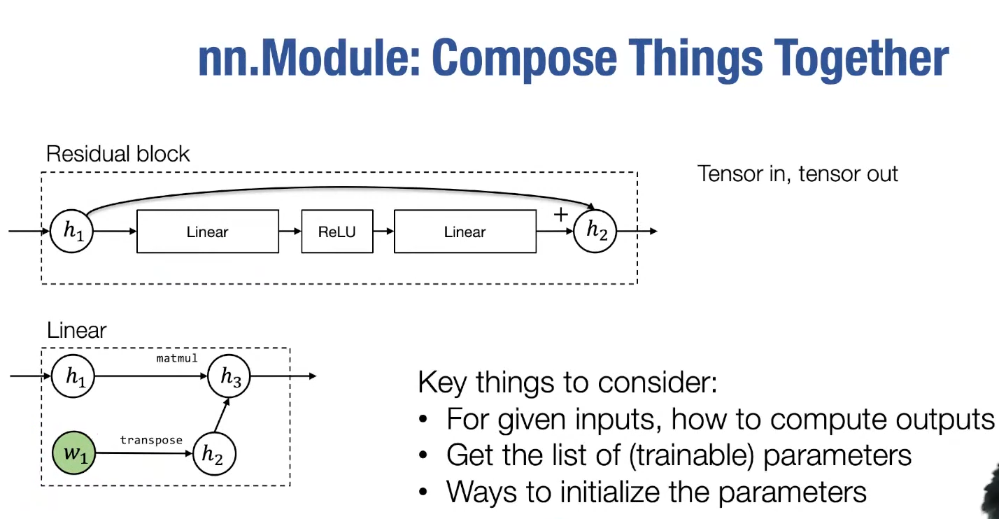
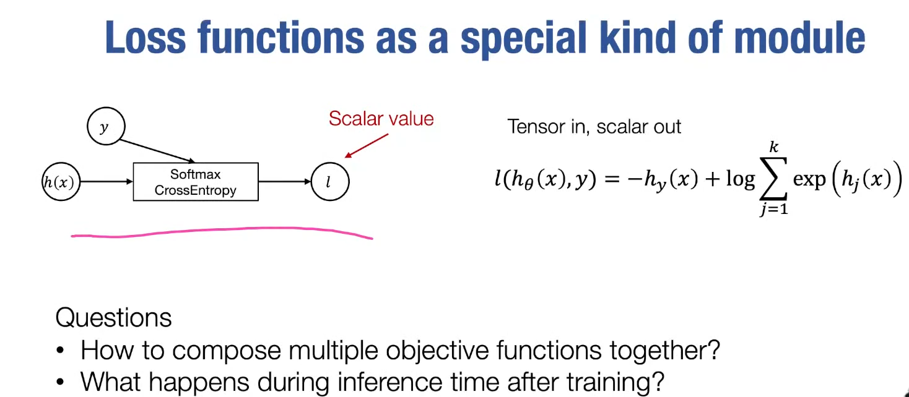
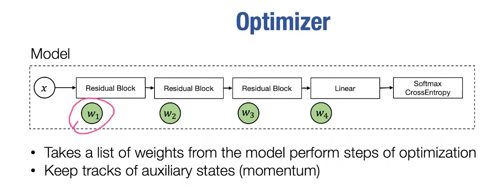
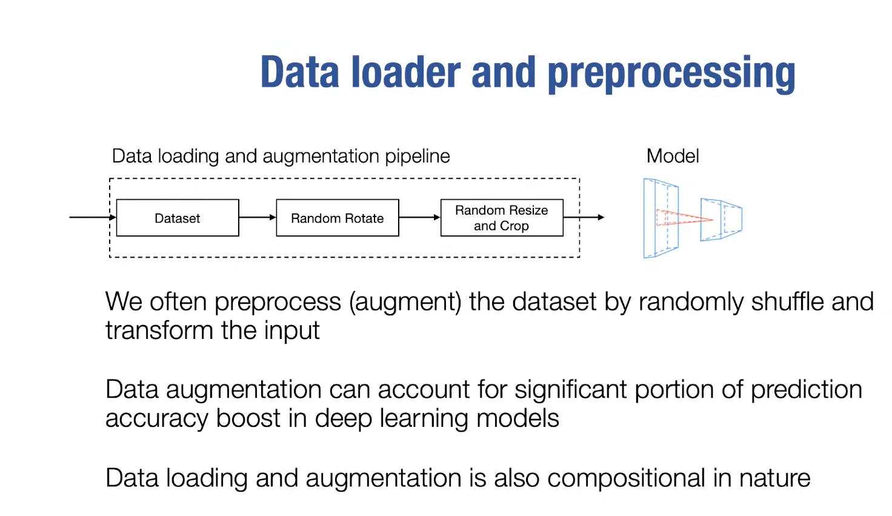
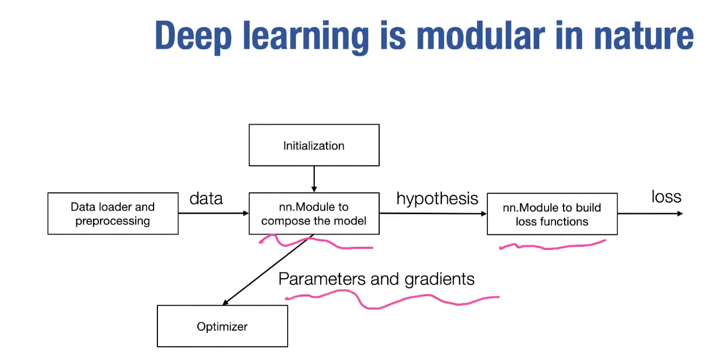

# Lec7-Neural Network Library Abstractions

# Neural Networks Abstraction
## Programming Abstraction
核心思想是host language是一个语言，但是执行计算图的时候可以用其他语言来优化

和sql & RDBMS有点相似 :thinking:
### declarative
这应该比较自然的想法，from google "scalable computational systems"

**描述**图 ==> 指定运行机器 ==> 运行 ==> 结果

### imperative

define and run
- 对*融合算子*友好
- 指定特定值有上面declarative的同样效果

## High level modular lib components

经典三明治

loss function is a special case of a "module"

**正则化**: 要么是损失函数的一部分，要么是优化器的一部分
**初始化**: 包含在nn.Module中

## 总结

