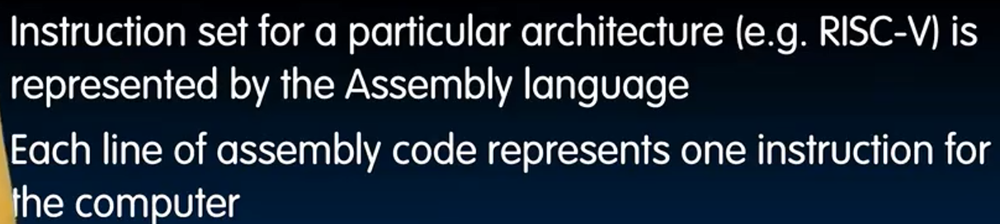
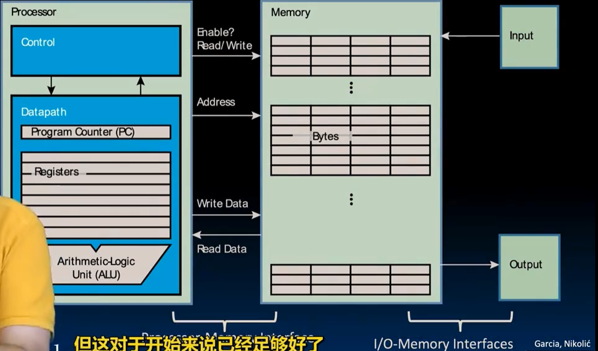
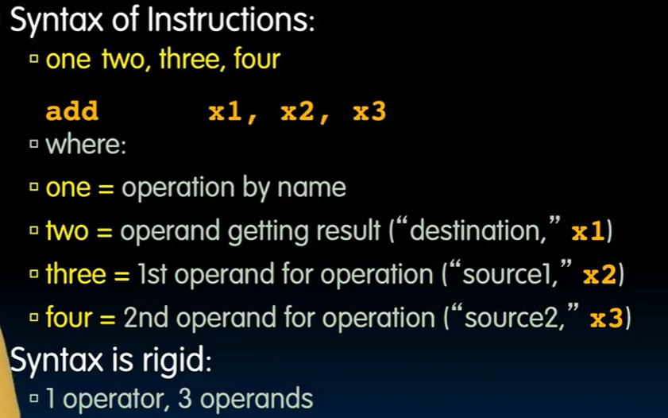
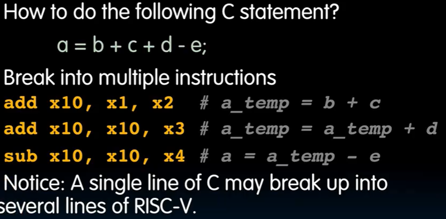
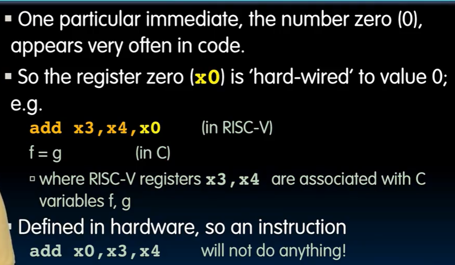

# Lec7-RISC-V Introduction

# RISC-V Introduction

## Instruction Set Architecture (ISA)


## Assembly Variables 
each statement is called an **instruction**
### Registers
where are registers ?



32 general purpose registers (GPRs) are available in RISC-V architecture.(x0 - x31)

word: 32 bits (can be 64 bits in RV64)

x0: always 0
\# is the comment character

### no type casting in RISC-V assembly language
the registers have no type

## add/sub instructions

### syntax of instructions

```
add rd, rs1, rs2
sub rd, rs1, rs2 # d(rd) = e(rs1) - f(rs2), 注意顺序
```


## Immediate values（立即数）
```assembly
addi rd, rs1, 10 
```
没有`subi` ，加上相反数即可

### Register 0


