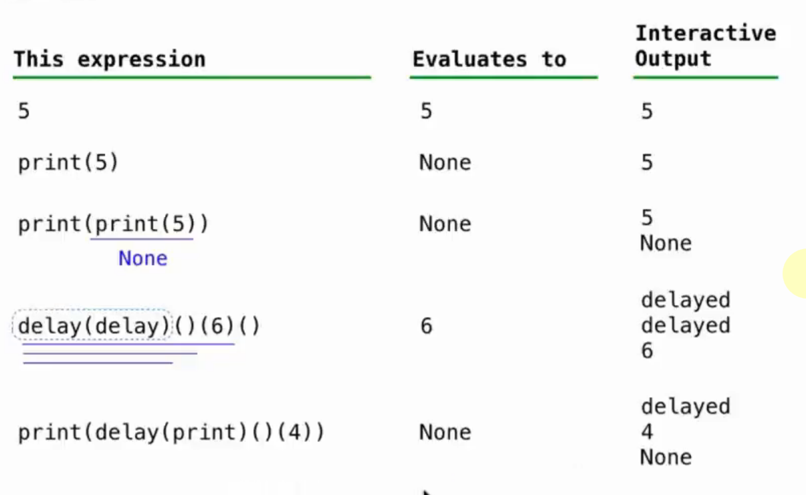
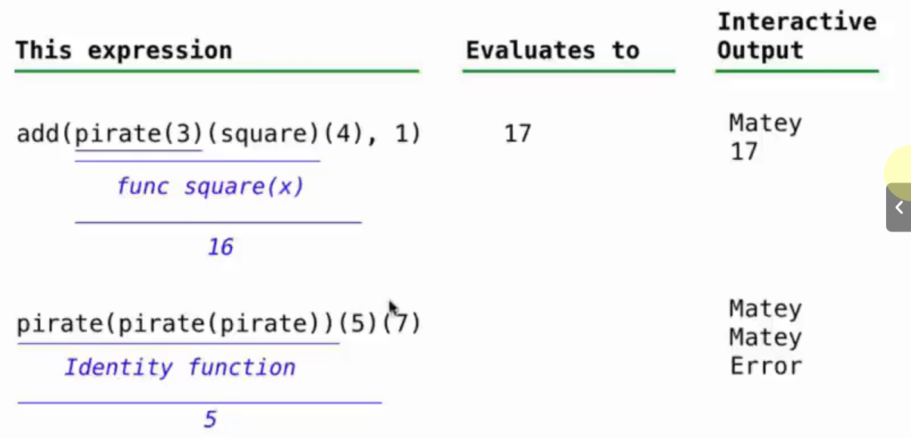
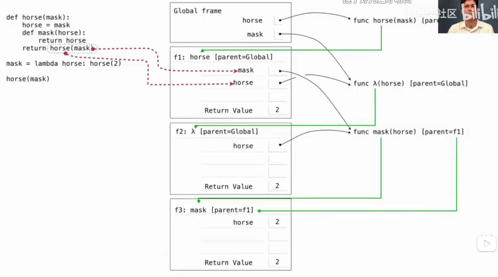
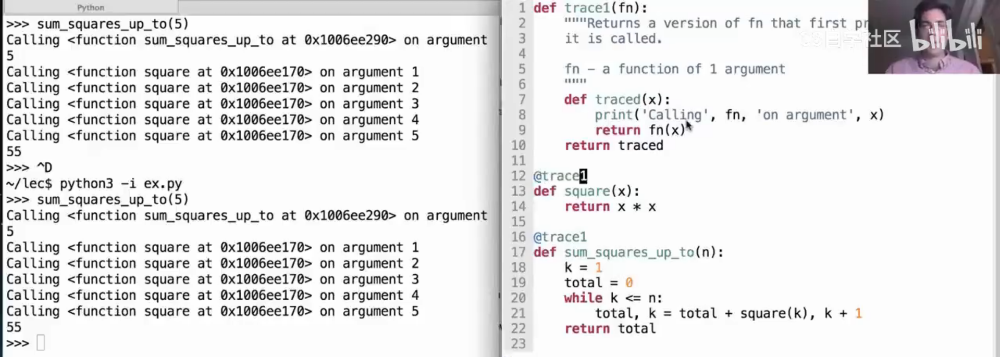
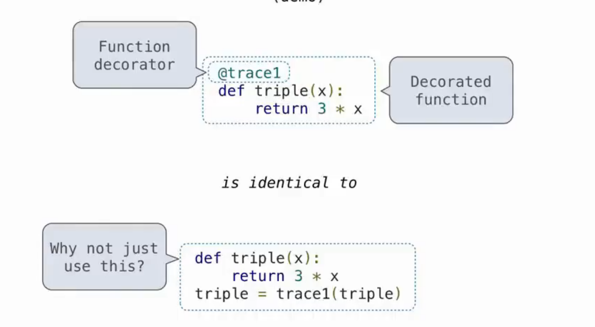

# Lec8-Function Example

# Function Example
## 1
```python
def delay(arg):
    print('delayed')
    def g():
        return arg
    return g
```



## 2

```python
def pirate(arggg):
    print('matey')
    def plunder():
        return arggg
    return plunder
```



## 3 horse mask
关键是两条红线



## 装饰器
本质上是一个HoF






