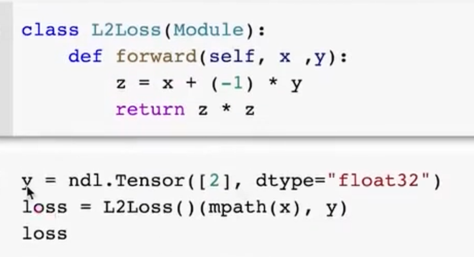
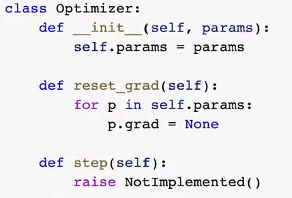
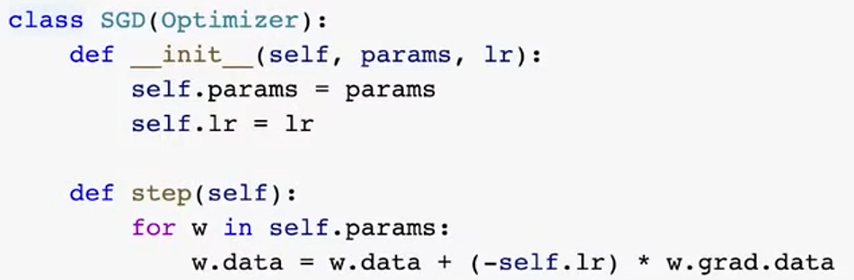
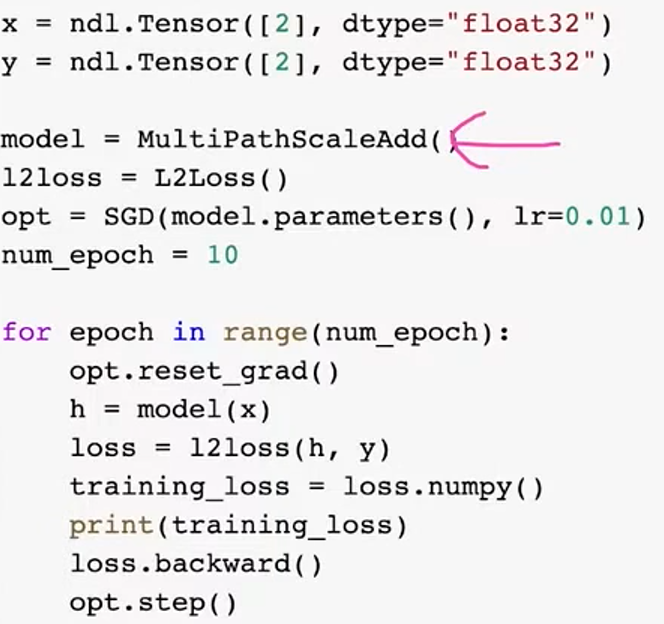

# Lec8-NN Library Implementation

# Neural Networks lib implementation
## refreshment
```python
import needle as ndl
```

```python
def data(self):
    return self.detach()
```
data 不要grad

## numerical stability
软回归数值不变性，上下同除
```python
def softmax(x):
    x = x - np.max(x)
    z = np.exp(x)
    return z / np.sum(z)
```

## nn.Module
### 参数
```python
class Parameter(ndl.Tensor):
    def __init__(self, data: np.ndarray, requires_grad=True, dtype="float32"):
        super().__init__(data, requires_grad=requires_grad, dtype=dtype)

w = Parameter([2, 1], dtype="float32")

isinstance(w, Parameter) # True
```
```python
# recursive function to get all parameters
def _get_params(value: ndl.Tensor)->List[Parameter]:
    if isinstance(value, Parameter):
        return [value]
    elif isinstance(value, dict):
        result = []
        for k, v in value.items():
            result += _get_params(v)
        return result
    if isinstance(value, Module):
        return value.parameters()

class Module:
    def parameters(self)->List[Parameter]:
        return _get_params(self.__dict__) # dict -> self's attributes, will be recursively searched for Parameter instances

    def __call__(self, *args, **kwargs):
        return self.forward(*args, **kwargs)

class ScalarAdd(Module):
    def __init__(self, init_s=1, init_b=0):
        self.s = Parameter([init_s], dtype="float32")
        self.b = Parameter([init_b], dtype="float32")

    def forward(self, x):
        return self.s * x + self.b
```
返回的是一个包含参数的列表

以上是无参数的层

## Optimizer


用data原地更新参数

