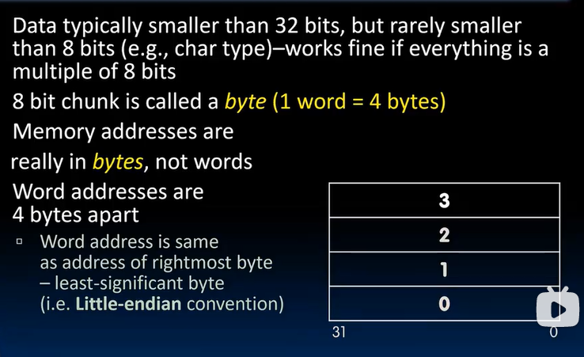
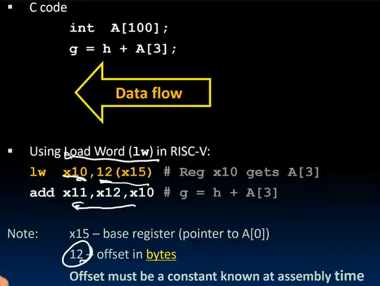
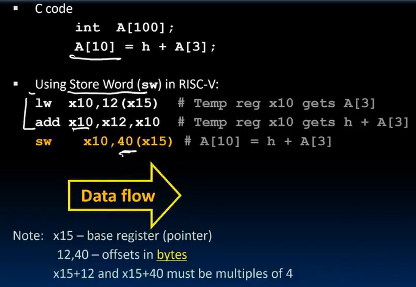
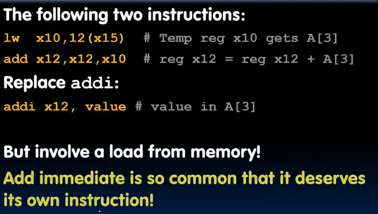
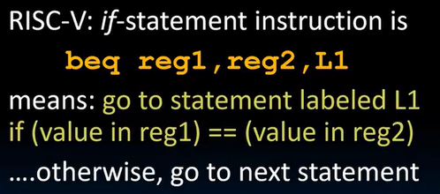
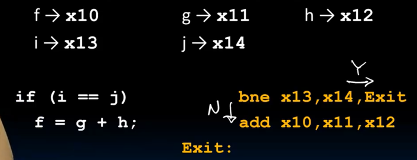
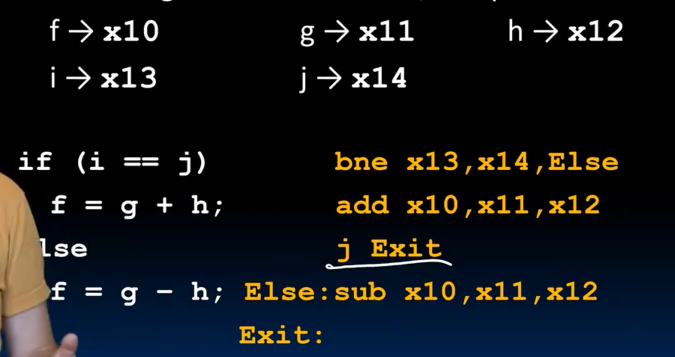
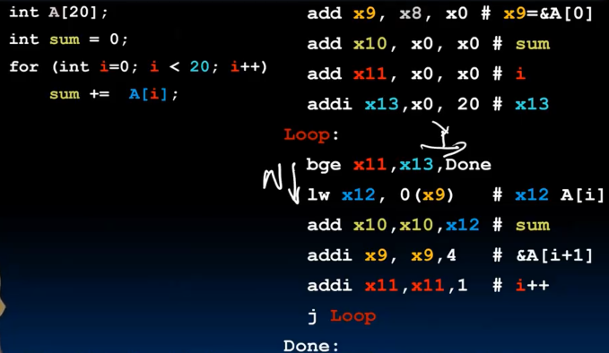

# Lec8-RISC-V lw, sw, Decision I

# RISC-V lw, sw, Decision I
## Intro
编译器会最小化寄存器使用

## layout in Memory

side note:
- a register is a 32-bit register(hold 32-bit data)
- word: 4 bytes, 32 bits
- risc-v 小端法（主流）

## Data Transfer Instructions
### lw (load word)

look note :thinking:

### sw (store word)

结合lec7的模式图来记忆

### lb/sb (load byte/store byte)
same as lw/sw 

lb 符号扩展

lbu: load byte unsigned


### why still addi?


- 更快
- 但是imm的范围更小 (32bit以内)

## Decision I
RV32 so far :yum:
```
add rd, rs1, rs2
sub rd, rs1, rs2
addi rd, rs1, imm
lw rd, imm(rs1)
sw rs2, imm(rs1)
lb rd, imm(rs1)
sb rs2, imm(rs1)
lbu rd, imm(rs1)
```

### beq/bne (branch if equal/not equal)


## Decision in RISC-V Assembly

- beq: branch if equal
- bne: branch if not equal
- blt: branch if less than `blt reg1, reg2, label` # if (reg1 < reg2) goto label
- bge: branch if greater than or equal
- bltu: branch if **unsigned** less than `bltu reg1, reg2, label` # if (reg1 < reg2) goto label
- bgeu: branch if **unsigned** greater than or equal
- j: jump/always branch `j label` # 无条件jump的范围比有条件jump构造出来的无条件jump更大（32位限制）

没有：`bgt` or `ble`, only have BLT（培根生菜番茄） sandwiches


注意“流”, 多数情况下条件似乎是翻着来翻译的


注意“j Exit”

### loops in C/Assembly



