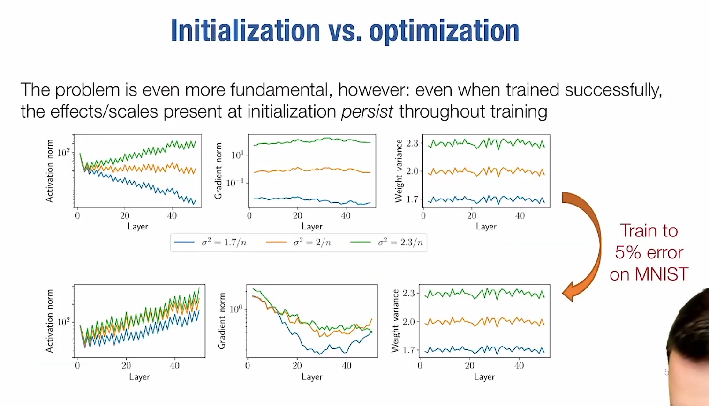
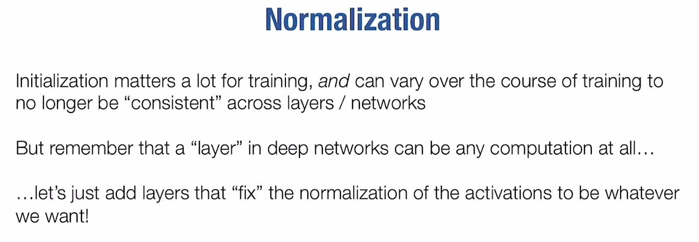
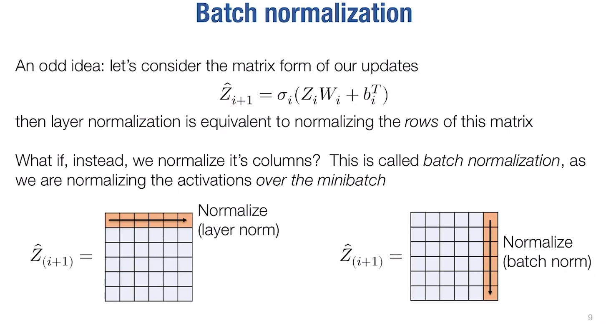
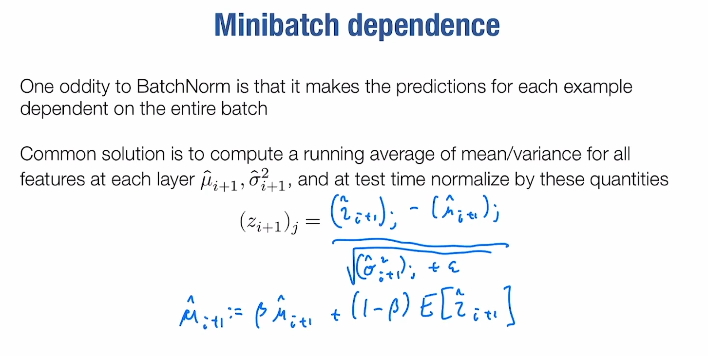
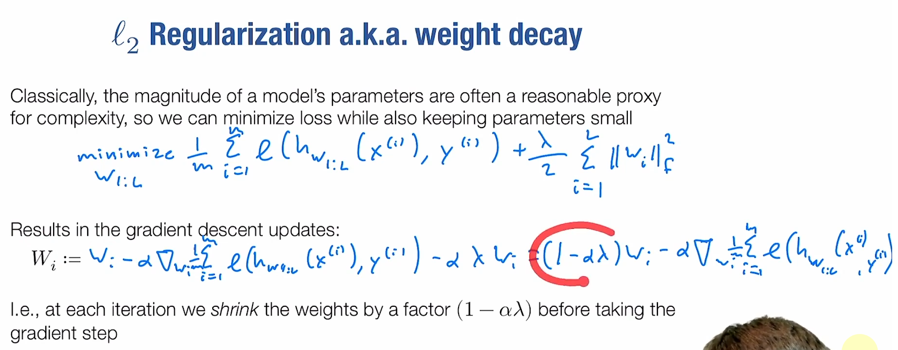
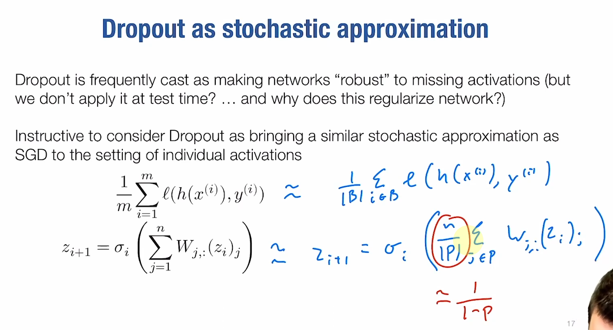
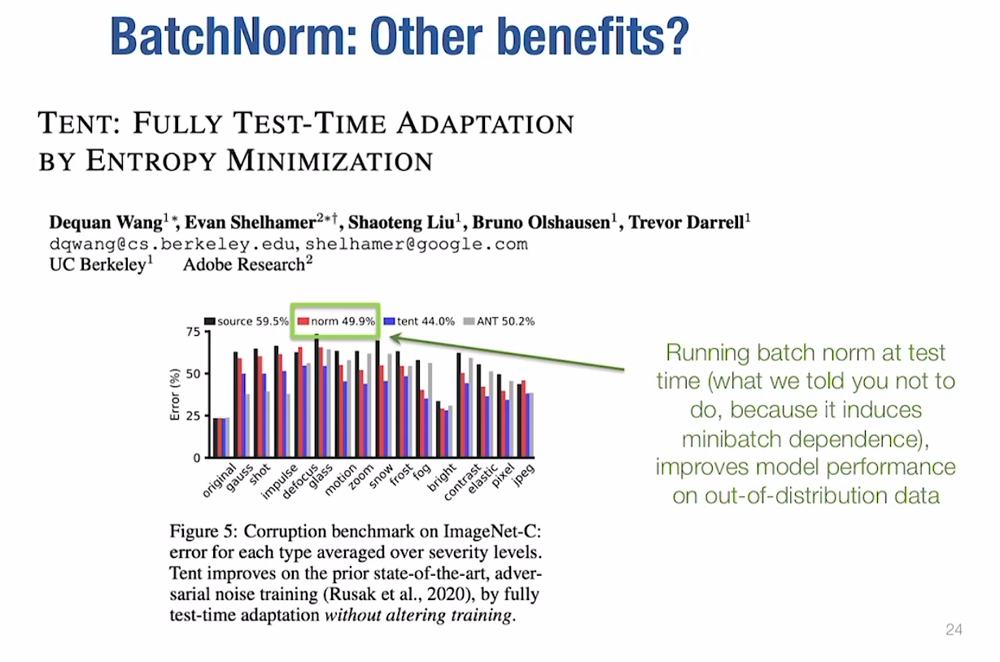

# Lec9-Normalization, Dropout, + Implementation

# Normalization and Regularization

## Normalization and Initialization

注意看weight variance的曲线，几乎不变

norm的思想来源

- layer normalization
- batch normalization

这么看来batch_norm确实很奇怪, odd! :cry:

## Regularization
### L2 Regularization
针对的是过拟合?但是只要是减少function class的操作都是regularization的一种

然后发现weight decay和regularization有联系！

### dropout

