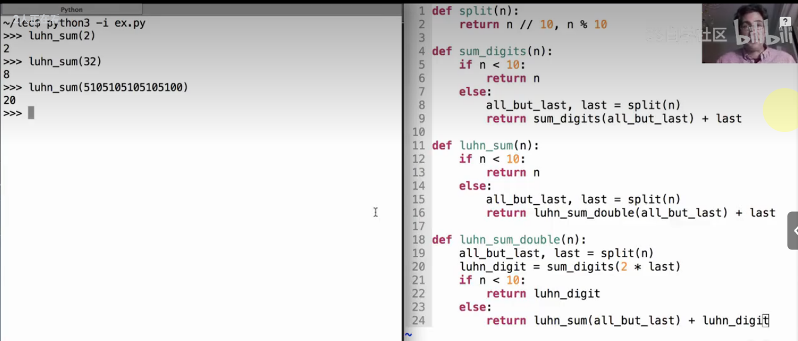

# Lec9-Recursion

# Recursion

## Self-reference
都是返回函数导致的 :yum:

然后函数再次被call，就形成了自我递归

## Recursive Functions

有一个细节，递归调用的frame的parent frame都是global而不是nested :thinking:

## Mutual Recursion
互相调用

## Recursion to Iteration

key: figure out what state must be maintained during the while loop

## Iteration to Recursion

Iteration is a special case of recursion :open_mouth:

