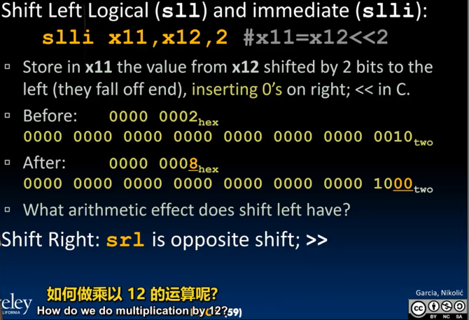
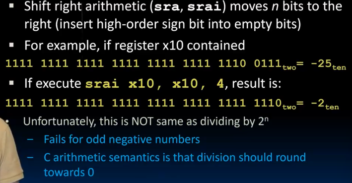
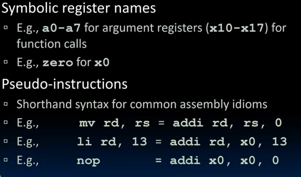
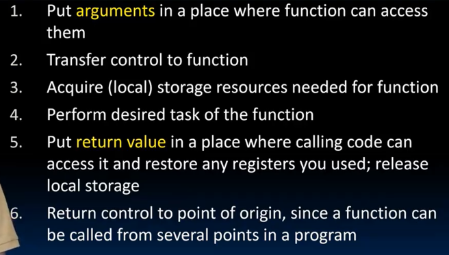
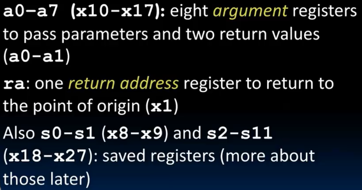
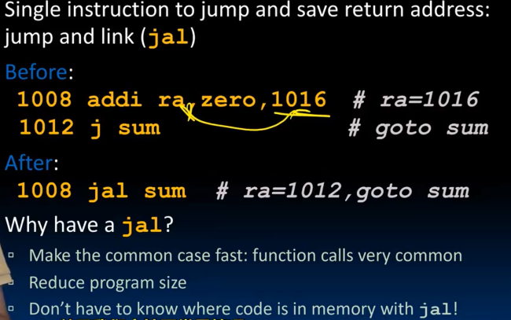

# Lec9-RISC-V Decisions II

# RISC-V Decisions II

## Logical Instruction
### and, andi, not
2种对应变体
- `and`: and x5, x6, x7 # x5 = x6 & x7
- `andi`: andi x5, x6, 0x7 # x5 = x6 & 0x7 # for masking :yum:
- `or`: or x5, x6, x7 # x5 = x6 | x7
- `xor`: xor x5, x6, x7 # x5 = x6 ^ x7


Not `not`, `xor` with 111111...1111即可

### shift instructions
logical shift


arithmetic shift


## A bit about machine programming

PC: program counter (special register), 程序计数器 指向下一条指令的地址（next 4 byte / 1 word away）


side note:
- symbolic name
- pseudo code

## Function calls
6 steps to call a function:


### conventions
in RISC-V, all instructions are 32-bit long, and stored in memory just like any other data. so below we show the address of where the programs are stored in memory.


- 8个ar
- 1个ra
- 12个sr

新的jump: 
- *jr*: `jr ra` (return from subroutine) 正是 `ret` 的具体实现
- `jalr` : `jalr rd, rs, imm` jump and link register, 跳转到指定地址并保存返回地址到ra
- `jal` : `jal FunctionLabel` / `jal rd, Label`


事实上，没有jr，j
```
j: jal x0, Label # 跳转到Label并保存返回地址到x0
```


